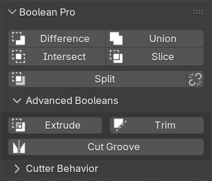
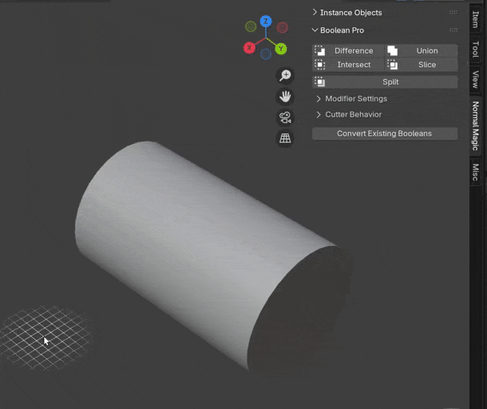
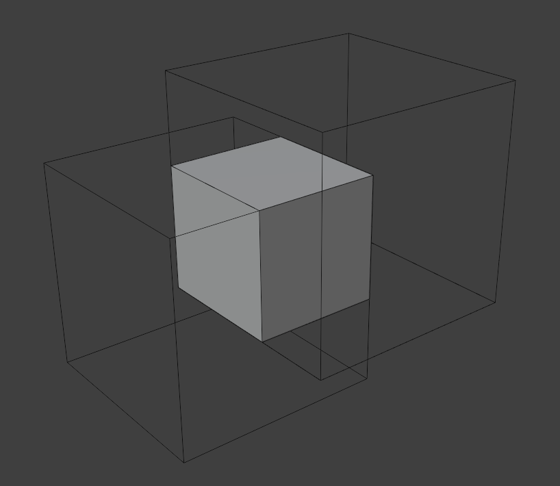
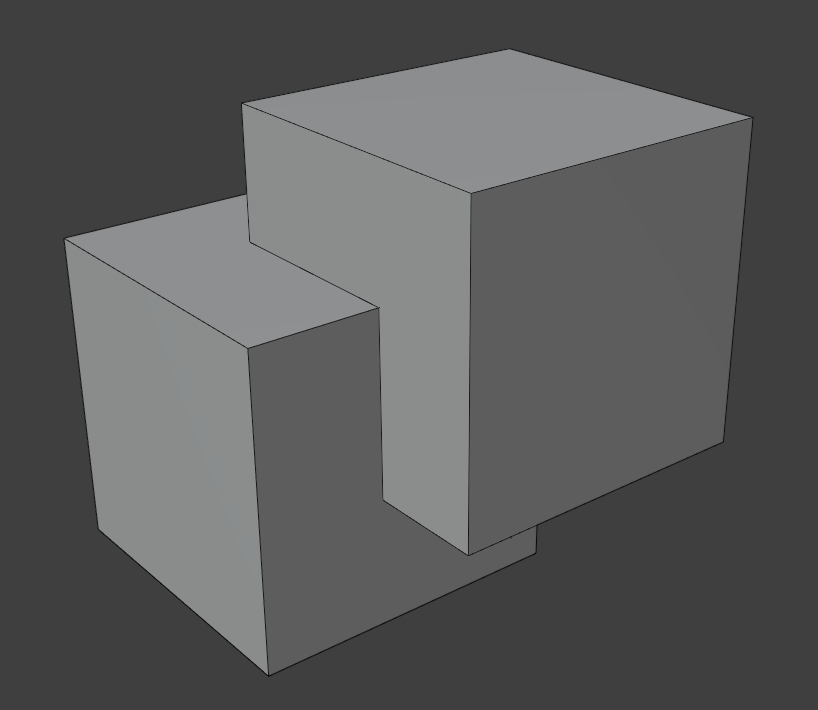
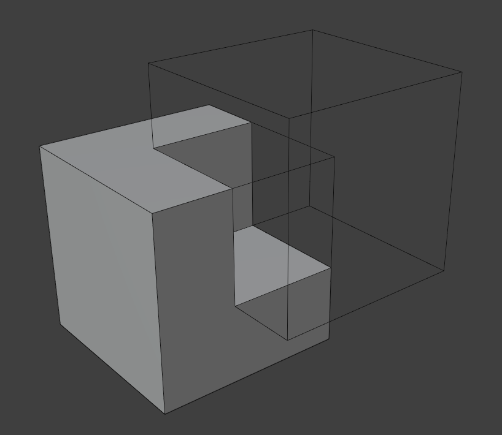
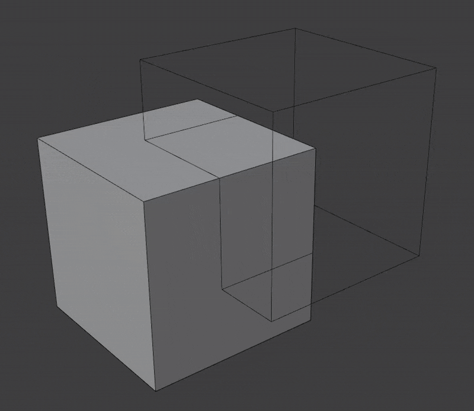

# Boolean Pro

This panel lets you quickly set up Boolean modifiers on selected geometry. Modifiers are added to the active object, other selected objects will be added as cutters. There are operators for adding the following modifiers:

- [Boolean Pro](../mesh_tools/boolean_pro.md)
- [Boolean Extrude](../mesh_tools/boolean_extrude.md)
- [Boolean Trim](../mesh_tools/boolean_trim.md)
- [Cut Groove](../mesh_tools/cut_groove.md)

- ### How to use

    

    **1.** Select cutter object(s).  
    **2.** Select the object you wish to cut.  
    **3.** Perform Boolean operation using the buttons.

## Boolean Pro Operators

The top of the panel contains operators for all Boolean Pro modes.

### Operations

| Intersect | Union | Difference | Slice |
|---|---|---|---|
| || ||

### Split
The "Split" Operator will duplicate the object:

- The original will get a **Difference** Boolean
- The duplicate will get a **Intersect** Boolean.
- The duplicate can be a linked copy by toggling the link option next to the button.

## Advanced Boolean Operators

The "Advanced Booleans" section lets you add the following modifiers:

- [Boolean Extrude](../mesh_tools/boolean_extrude.md)
- [Boolean Trim](../mesh_tools/boolean_trim.md)
- [Cut Groove](../mesh_tools/cut_groove.md)

## Modifier Settings

To change the default settings for any modifier, use the [Modifier Defaults](./modifier_defaults.md) menu to save defaults from a modifier.

## Cutter Behavior

This section lets you choose what happens to objects when you add a Boolean.

- **Display As.** Change the display mode of the cutter object:
    - **Wireframe.** Display cutter as wireframe.
    - **Bounds.** Display cutter as bounding box.

- **Collection.** When enabled, specify the name of a collection to add cutter objects to. If the collection doesn't exist one will be created.
- **Deselect.** Which objects get deselected after the boolean operation:
    - **None.** Keep all objects selected.
    - **Main Object.** Deselect the object that receives the modifier.
    - **Cutters.** Deselect cutter object(s)
- **Parent to Object.** Parent the cutter object(s) to the main object. This will transform them together when you move the main object.
- **Link Split Mesh.** When performing the [Split](#split) operation, link the intersected mesh to the original so editing one mesh edits the other too.
- **Auto-Smooth.** Apply Blender's "Smooth By Angle" modifier to objects in Boolean operation if they don't have one already:
    - **Cutters.** Apply smoothing to cutter object(s).
    - **All.** Apply smoothing to all objects involved in the Boolean.
    - **None.** Don't apply smoothing to any objects.
- **Angle.** Angle to set auto-smoothing at when "Auto-Smooth" is turned on.

## Convert Existing Booleans

Will convert all 'Boolean' modifiers on selected objects to 'Boolean Pro'. All relevant settings will be transferred.