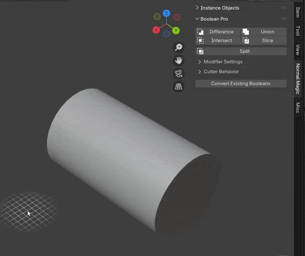

# Boolean Pro

These tools make it easier to use the [Boolean Pro](../mesh_tools/boolean_pro.md) modifier.

## Top Panel Operators

The top of the panel contains operators for all Boolean Pro modes.

- ### How to use

    

    **1.** Select cutter object(s).  
    **2.** Select the object you wish to cut.  
    **3.** Perform Boolean operation using the buttons.

### Operations

| Intersect | Union | Difference | Slice |
|---|---|---|---|
| || ||

### Split
The "Split" Operator will duplicate the object:

- The original will get a **Difference** Boolean
- The duplicate will get a **Intersect** Boolean. There is an option under [Cutter Behavior](#cutter-behavior) to make the intersection object linked.

## Modifier Settings

This section lets you change what settings the Boolean Pro modifiers get **before being added** (Settings for existing modifiers won't be updated).

All options in this section are covered on the [Boolean Pro modifier](../mesh_tools/boolean_pro.md) page.

## Cutter Behavior

This section lets you choose what happens to objects when you add a Boolean.

- **Display As.** Change the display mode of the cutter object:
    - **Wireframe.** Display cutter as wireframe.
    - **Bounds.** Display cutter as bounding box.

- **Collection.** When enabled, specify the name of a collection to add cutter objects to. If the collection doesn't exist one will be created.
- **Deselect.** Which objects get deselected after the boolean operation:
    - **None.** Keep all objects selected.
    - **Main Object.** Deselect the object that receives the modifier.
    - **Cutters.** Deselect cutter object(s)
- **Parent to Object.** Parent the cutter object(s) to the main object. This will transform them together when you move the main object.
- **Link Split Mesh.** When performing the [Split](#split) operation, link the intersected mesh to the original so editing one mesh edits the other too.
- **Auto-Smooth.** Apply Blender's "Smooth By Angle" modifier to objects in Boolean operation if they don't have one already:
    - **Cutters.** Apply smoothing to cutter object(s).
    - **All.** Apply smoothing to all objects involved in the Boolean.
    - **None.** Don't apply smoothing to any objects.
- **Angle.** Angle to set auto-smoothing at when "Auto-Smooth" is turned on.

## Convert Existing Booleans

Will convert all 'Boolean' modifiers on selected objects to 'Boolean Pro'. All relevant settings will be transferred.