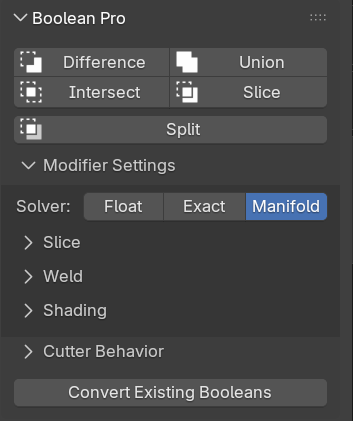

# normalMagic Add-on

This add-on is included with the **Pro** version of normalMagic and makes working with certain modifiers easier.

- [:octicons-download-16: Install Add-on](../install.md#add-on)

- [:fontawesome-solid-gears: Preferences](./preferences.md)

- [:material-select-multiple: Boolean Pro](./boolean_pro.md)

    ---
    
    

    Set up booleans using the Boolean Pro [modifier](../mesh_tools/boolean_pro.md) with one click and convert existing booleans.

- [:octicons-link-16: Instance Objects](./instance_objects.md)
    
    ---

    

    Duplicate objects as instances using the Instance Object [modifier](../other_tools/instance_object.md) with one click.

