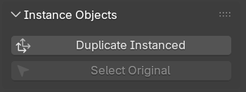

# Instance Objects

These tools make it easier to use the [Instance Object](../other_tools/instance_object.md) modifier.

## Duplicate Instanced

This operator that acts like Blender's built-in [Duplicate Linked](https://docs.blender.org/manual/en/latest/scene_layout/object/editing/duplicate_linked.html) but also copies the results of all modifiers:

The **instanced** object can be duplicated with any existing methods e.g. ++'Shift'+'D'++ and will keep the same behavior.

Using this operator on an object that already is using a "Instance Object" as it's last modifier will instance the original object to keep things simple.

### What it does

For each selected object:

1. Create a new object with the same mesh data as selected object. This is so you can still enter "Edit Mode" on the instance.
2. Add [Instance Object](../other_tools/instance_object.md) modifier and specify selected object.
3. Select instance object and deselect original.

## Select Original

Selects the original object(s) being instanced by selected object(s). This is useful when you wish to change modifier behavior on the original.