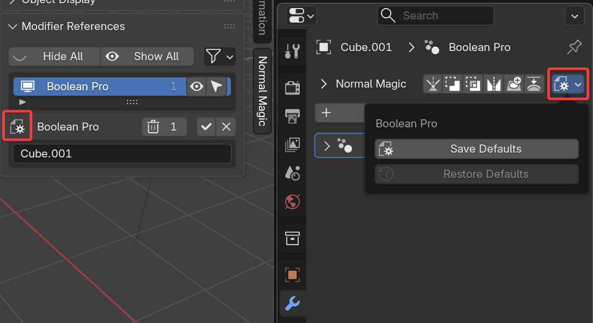

# Modifier Defaults

You can save default settings for any modifier added via normalMagic operators.

!!! note "Note"
    This will have no effect on modifiers added through the "Add Modifier" menu.

This is achieved through the **Modifier Defaults** menu, available in the [Modifier Header](../add-on/modifier_header.md) bar and the [Modifier References](./modifier_references.md) panel.

