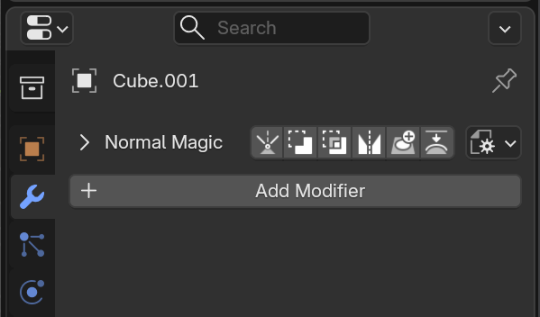

# Modifier Header

The optional modifier header bar gives quick access to several normalMagic features without using the sidebar. From left to right:

### Expand Arrow

Show the [Modifier References](./modifier_references.md) panel below.

### Operators Bar

A row of buttons for quickly adding normalMagic operators. These can configured in [preferences](./preferences.md). 

All of these allow for multi-object selection, for assigning cutters for example.

### Modifier Defaults

Saves all the settings for the active modifier. This will be used any time a modifier of the same type is added via the add-on. See [here](./modifier_defaults.md) for more info.