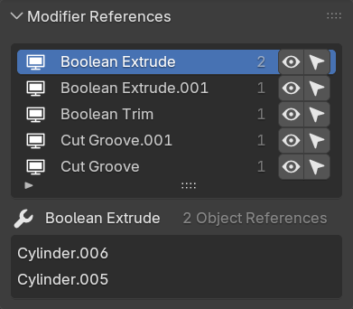
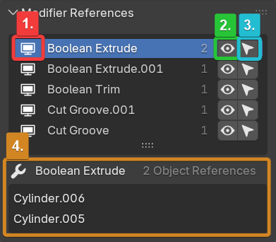

# Modifier References

Use this panel to manage complex non-destructive scenes with many cutters, inserts, or other objects referenced by modifiers.

!!! info "Active Object"
    This panel shows modifiers for the **active object** only i.e. modifiers that show up in Blender's modifiers panel.

Instantly select, show or hide objects that are referenced by the active object's modifiers.

## UI Breakdown

The main list displays every modifier on the active object that references other objects. Selecting a modifier will also select it in the object's modifier panel and display it's individual references below.

- 

- 

    **1.** **Toggle** the modifier. This makes it easy to see what effect this modifier is having.

    **2.**  **Show/hide** the referenced objects.

    **3.** **Select/deselect** the referenced objects.
    
    **4.** Below shows the type of the selected modifier and lists the individual referenced objects

