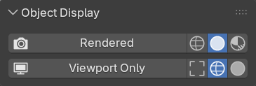

# Object Display

This panel helps manage object's visibility. Assigning a mesh as ***Viewport Only*** will hide it from all renders but keep it visible in the viewport.

This is particularly useful for objects referenced by [Mesh Modifiers](../mesh_tools/index.md) such as [Surface Insert](../mesh_tools/surface_insert.md)

## Rendered
Show object in renders and viewport. Applies default "visible" object properties.

Display in viewport as either **Wire**, **Solid** (default), or **Textured**.

## Viewport Only
Hides object from all renders but keeps it visible in the viewport.

Display in viewport as either **Bounds**, **Wire** (default), or **Solid**.