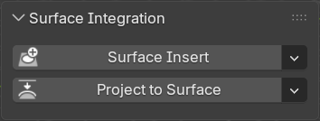
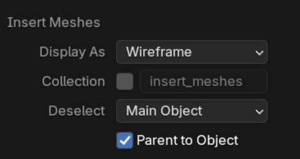
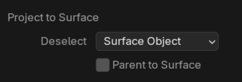

# Surface Integration

This panel contains operators to quickly add [Surface Insert](../mesh_tools/surface_insert.md) and [Project to Surface](../mesh_tools/project_to_surface.md) modifiers.

## Surface Insert

Add a [Surface Insert](../mesh_tools/surface_insert.md) modifier to the active object.

### How to Use

1. (Optional) Select 1-6 insert meshes
2. Select surface mesh last
3. Press the ++"Surface Insert"++ button

### Insert mesh options

Similar to the Boolean [cutters](../add-on/boolean_pro.md#cutter-behavior) menu, there are options for what to do with insert meshes.

## Project to Surface

Add a [Project to Surface](../mesh_tools/project_to_surface.md) modifier to all selected objects but the last selected.

### How to Use

1. Select one or more objects you wish to project
2. Select the surface mesh last
3. Press the ++"Project to Surface"++ button

### Projection Mesh Options

Similar to the Boolean [cutters](../add-on/boolean_pro.md#cutter-behavior) menu, there are options for what to do with the projected meshes.

