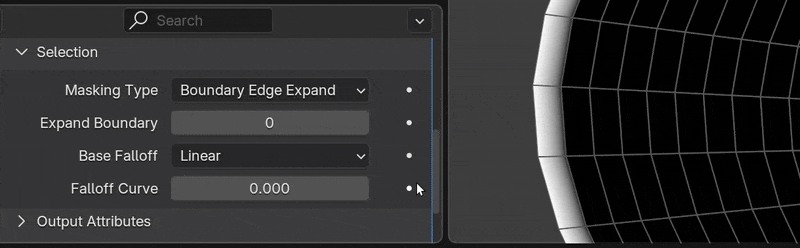
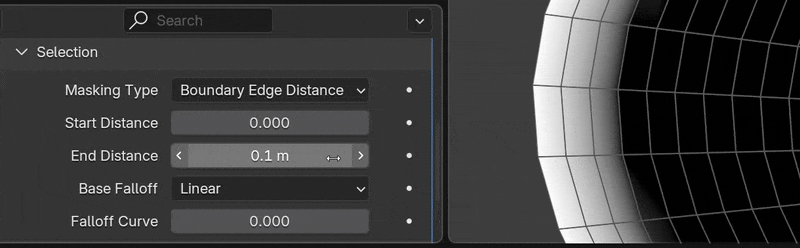
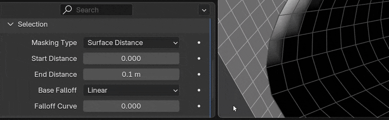
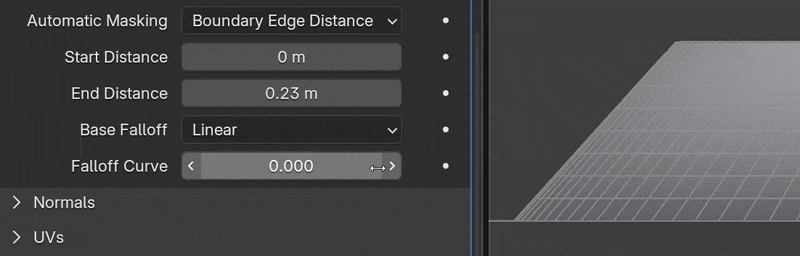
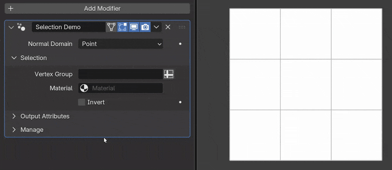

# Common Settings
Many tools share common options, for reference they are listed on this page.

---

## Mask Falloff
When two sets of data blend together there are often falloff controls. These can be found across normalMagic in tools such as [Normal Transfer](normal_tools/normal_transfer.md), [Surface Insert](mesh_tools/surface_insert.md) and [Surface Project](mesh_tools/surface_project.md).

### Masking Type
#### Boundary Edge Expand
Select vertices on the boundary edge and expand selection inwards with a linear falloff.

- **Expand Iterations.** How many iterations to expand mask inwards. 

#### Boundary Edge Distance
Select vertices based on their distance to a boundary edge with a linear falloff.

- **Start Distance.** Distance at which vertices will get a value of 1.
- **End Distance.** Distance at which vertices will get a value of 0.

#### Surface Distance
Select vertices based on their distance to the target geometry.

- **Start Distance.** Distance at which vertices will get a value of 1.
- **End Distance.** Distance at which vertices will get a value of 0.

### Base Falloff
The falloff used for values between 0-1. Here it is being used in [Surface Project](./mesh_tools/surface_project.md)

### Falloff Curve
Bias the selection towards 1. Here it is being used in [Surface Project](./mesh_tools/surface_project.md)

---

## Selection
Often we'll want to limit the effects of modifiers to certain areas. The "Selection" section is the same for many tools. It allows for partial selection and, when normals are stored on face corners, hard boundaries.

- **Vertex Group.** Specify a vertex group to limit modifier's effect.
- **Face Group (Face Corner Only).** Specify a vertex group that will have hard boundaries.
- **Material.** Limit the modifier's effect to a specific material.
- **Invert.** Invert selection

Here we can see how **Vertex Group** and **Face Group** can be combined:

