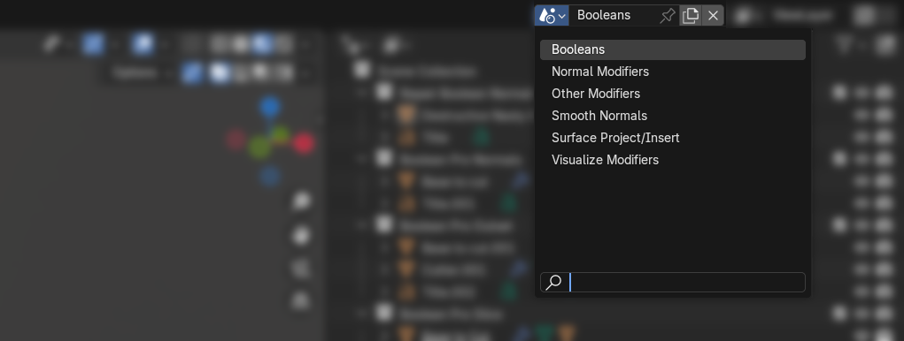
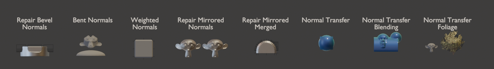
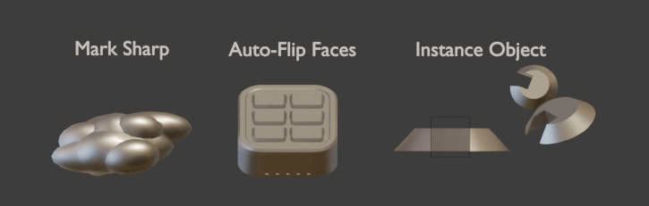

# Examples
Examples for all tools can be found in the "Examples" file available as a separate download on the store page: ***normalMagic \[version\] Examples.blend***

This file contains several scenes, each showing different categories of tools.

## Booleans
Examples showing various uses of [Boolean Pro](./mesh_tools/boolean_pro.md) and [Repair Boolean Normals](./normal_tools/repair_boolean_normals.md).

## Normal Modifiers
Examples showing normal modifiers in use:
[Repair Bevel Normals](./normal_tools/repair_bevel_normals.md), [Bent Normals](./normal_tools/bent_normals.md), [Face Weighted Normals](./normal_tools/face_weighted_normals.md), [Repair Mirrored Normals](./normal_tools/repair_mirrored_normals.md), [Normal Transfer](./normal_tools/normal_transfer.md).

## Other Modifiers
Examples showing "other" modifiers in use: [Mark Sharp](./other_tools/mark_sharp.md), [Auto-Flip Faces](./other_tools/auto-flip_faces.md), [Instance Object](./other_tools/instance_object.md).

## Smooth Normals
Examples showing various uses of [Smooth Normals](./normal_tools/smooth_normals.md).

## Surface Project/Insert
Examples showing various uses of [Surface Project](./mesh_tools/surface_project.md) and [Surface Insert](./mesh_tools/surface_insert.md).

## Visualize Modifiers
Examples showing [View Normals](./visualize_tools/view_normals.md) and [View Sharp](./visualize_tools/view_sharp.md).

