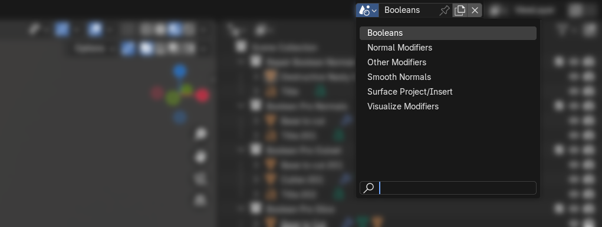
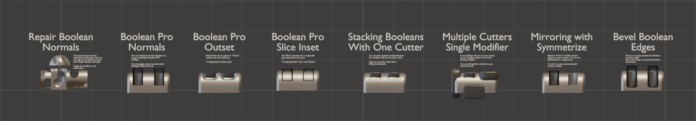
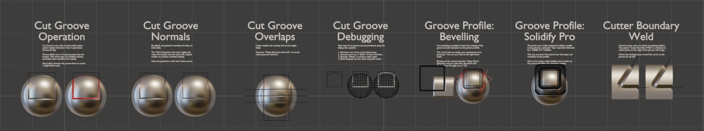
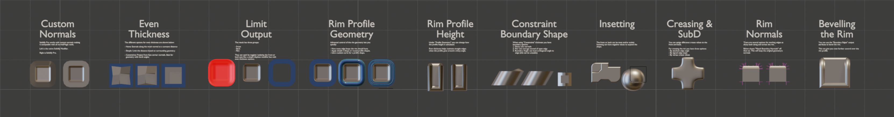
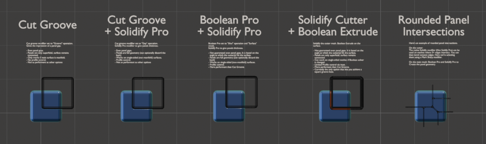
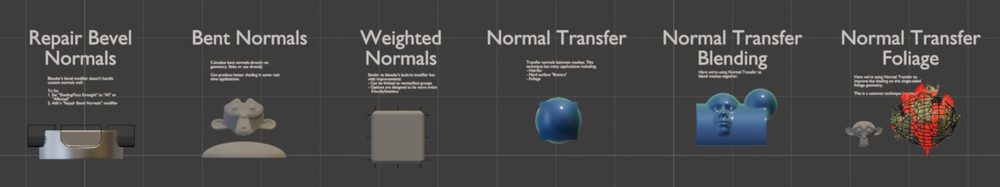
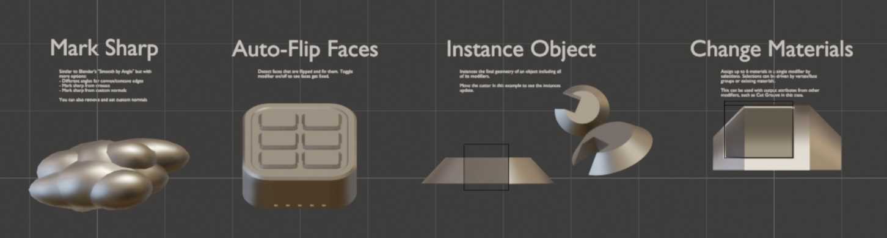
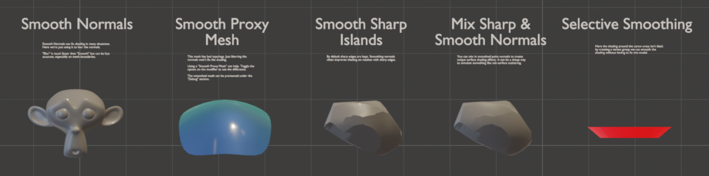
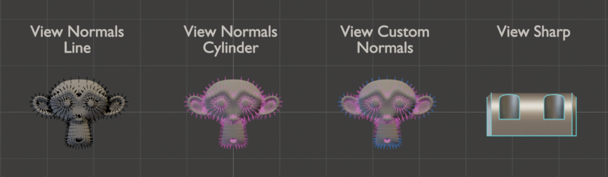
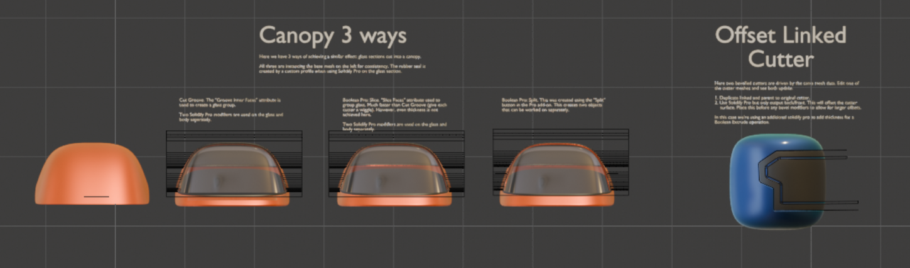

# Examples

## Example Scenes
Examples for all tools can be found in the "Examples" file, available as a separate download on the store page: ***normalMagic \[version\] Examples.blend***

This file contains several scenes, each showing different categories of tools.

## Boolean Pro
Examples for [Boolean Pro](./mesh_tools/boolean_pro.md) and [Repair Boolean Normals](./normal_tools/repair_boolean_normals.md).

## Boolean Extrude/Trim
Examples for [Boolean Extrude](./mesh_tools/boolean_extrude.md) and [Boolean Trim](./mesh_tools/boolean_trim.md).

## Cut Groove
Examples for [Cut Groove](./mesh_tools/cut_groove.md).

## Solidify Pro
Examples for [Solidify Pro](./mesh_tools/solidify_pro.md).

## Surface Insert / Project to Surface
Examples for various uses of [Surface Insert](./mesh_tools/surface_insert.md) and [Project to Surface](./mesh_tools/project_to_surface.md).

## Panel Methods
Examples for creating panels/panel lines using normalMagic modifiers. More examples are covered in [Workflows 1](#workflows-1).

## Normal Modifiers
Examples for normal modifiers in use:
[Repair Bevel Normals](./normal_tools/repair_bevel_normals.md), [Bent Normals](./normal_tools/bent_normals.md), [Face Weighted Normals](./normal_tools/face_weighted_normals.md), [Repair Mirrored Normals](./normal_tools/repair_mirrored_normals.md), [Normal Transfer](./normal_tools/normal_transfer.md).

## Other Modifiers
Examples for "other" modifiers in use: [Mark Sharp](./other_tools/mark_sharp.md), [Auto-Flip Faces](./other_tools/auto-flip_faces.md), [Instance Object](./other_tools/instance_object.md).

## Smooth Normals
Examples for various uses of [Smooth Normals](./normal_tools/smooth_normals.md).

## Visualize Modifiers
Examples for [View Normals](./visualize_tools/view_normals.md) and [View Sharp](./visualize_tools/view_sharp.md).

## Workflows 1
Three approaches to a non-destructive canopy and example of how to offset cutters.

