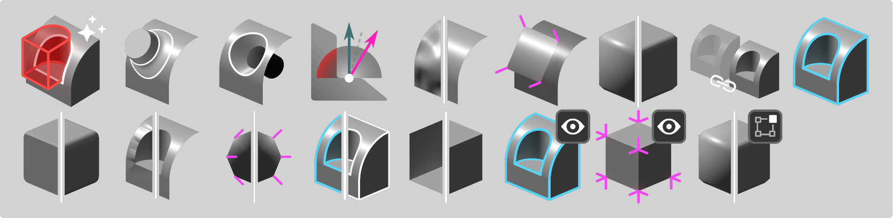

# normalMagic Home

!!! warning "Site under construction :construction_site: :construction:"

Welcome to the **normalMagic** documentation. Here you'll find everything there is to know about the tools.

- [:octicons-download-16: Install normalMagic](install.md)
- [:material-run: Examples](examples.md)

## What is normalMagic?
normalMagic is a collection of tools for [Blender](https://www.blender.org/) that offer powerful new modelling workflows and advanced control over mesh normals.

Controlling normals can be essential for creating high quality 3D artwork. Everything from hard surfaces, organic shapes, foliage, hair and fur, either realistic or stylized can benefit from modifying normals. Sometimes it's the only way to get surfaces shading the way you want.

!!! info "Custom Normals"
    Most of these tools create or edit ***custom normals***.

    Once custom normals exist on a mesh, some default Blender tools/modifiers might not behave as expected. 
    Tools are included to fix situations such as [mirroring](normal_tools/repair_mirrored_normals.md) or [beveling](normal_tools/repair_bevel_normals.md) but it's something to be aware of.

## Tool Highlights

### :material-check-circle: **Perfect boolean normals**

- Completely avoid boolean normal issues with [Boolean Pro](mesh_tools/boolean_pro.md).
- Repair normals on previously cut geometry with [Repair Boolean Normals](normal_tools/repair_boolean_normals.md).

### :material-check-circle: **Seamlessly blend surfaces**

- Project positions, normals and UVs with [Surface Project](mesh_tools/surface_project.md).
- Merge, cut and weld projected meshes into a surface with [Surface Insert](mesh_tools/surface_insert.md).

Convenient auto-masking options means no need for creating and managing vertex groups. Sharp edges can be preserved and transferred.

### :material-check-circle: **Smooth and Transfer Normals**

- Smooth and flatten normals normals to improve shading, achieve good toon lighting or for cheap subsurface scattering effects with [Smooth Normals](normal_tools/smooth_normals.md)
- Transfer and blend normals between unconnected meshes using [Normal Transfer](./normal_tools/normal_transfer.md)

## Contact

If anything is unclear or missing, please reach out!  

:simple-discord: [spaghetTools Discord](https://discord.gg/CtpZWGHFhG)  
:material-email: <spaghetmenot@gmail.com>  
:fontawesome-brands-bluesky: [@spaghetmenot.bsky.social](https://bsky.app/profile/spaghetmenot.bsky.social)  
:fontawesome-brands-mastodon: [@SpaghetMeNot@mastodon.social](https://mastodon.social/@SpaghetMeNot)