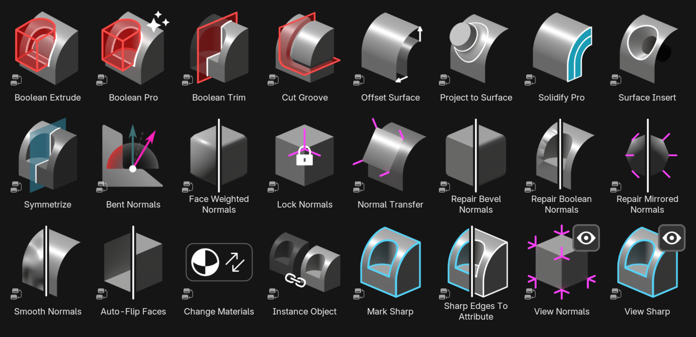

# normalMagic 2.0

Welcome to the **normalMagic** documentation. Here you'll find everything there is to know about the tools.

!!! info "Blender 5.0 Required"
    normalMagic 2.0 requires **Blender 5.0** or higher. For 4.5 support please use version [1.1](https://spaghetmenot.github.io/normalmagic/1.1/)

- [:octicons-download-16: Install normalMagic](install.md)
- [:material-run: Examples](examples.md)

## Quick Links

- [:material-cube-outline: Mesh Modifiers](mesh_tools/index.md)
- [:material-vector-polyline: Normal Modifiers](normal_tools/index.md)
- [:material-eye: Visualize Modifiers](visualize_tools/index.md)
- [:octicons-tools-16: Other Modifiers](other_tools/index.md)

## What is normalMagic?
normalMagic is a collection of tools for [Blender](https://www.blender.org/) that offer powerful new modelling workflows and advanced control over mesh normals.

<iframe width="900" height="390" src="https://www.youtube.com/embed/EuX4LF4xXw4?si=UfmnRjCYEnmySuVV" title="YouTube video player" frameborder="0" allow="accelerometer; autoplay; clipboard-write; encrypted-media; gyroscope; picture-in-picture; web-share" referrerpolicy="strict-origin-when-cross-origin" allowfullscreen></iframe>

Controlling normals can be essential for creating high quality 3D artwork. Hard surfaces, organic shapes, foliage, hair and fur can benefit from modifying normals. Sometimes it's the only way to get surfaces shading the way you want.

!!! info "Custom Normals"
    Most of these tools create or edit ***custom normals***.

    Once custom normals exist on a mesh, some default Blender tools/modifiers might not behave as expected. 
    Tools are included to fix situations such as [mirroring](normal_tools/repair_mirrored_normals.md) or [beveling](normal_tools/repair_bevel_normals.md) but it is something to be aware of.

    See this video for more information: [Custom Normal Issues](https://youtu.be/NoISc01URHg?si=s6NedSzDIFr30zOe)

[:material-beehive-outline:  Buy on Superhive](https://superhivemarket.com/products/normalmagic){ .md-button }
[:simple-gumroad:  Buy on Gumroad](https://spaghetmenot.gumroad.com/l/normalmagic){ .md-button .md-button--primary }

## Tool Highlights

### :material-check-circle: **Advanced Booleans, perfect normals**

- Completely avoid boolean normal issues with [Boolean Pro](mesh_tools/boolean_pro.md).
- Repair normals on previously cut geometry with [Repair Boolean Normals](normal_tools/repair_boolean_normals.md).
- Perform advanced Boolean operations with [Boolean Extrude](./mesh_tools/boolean_extrude.md), [Boolean Trim](./mesh_tools/boolean_trim.md) and [Cut Groove](./mesh_tools/cut_groove.md). 

### :material-check-circle: **Seamlessly blend surfaces**

- Project positions, normals and UVs with [Project to Surface](mesh_tools/project_to_surface.md).
- Merge, cut and weld projected meshes into a surface with [Surface Insert](mesh_tools/surface_insert.md).

Convenient auto-masking options means no need for creating and managing vertex groups. Sharp edges can be preserved and transferred.

### :material-check-circle: **Smooth and Transfer Normals**

- Smooth and flatten normals normals to improve shading, achieve good toon lighting or for cheap subsurface scattering effects with [Smooth Normals](normal_tools/smooth_normals.md).
- Transfer and blend normals between unconnected meshes using [Normal Transfer](./normal_tools/normal_transfer.md).

## What's New in 2.0?
<iframe width="900" height="390" src="https://www.youtube.com/embed/0sf4ywieXwA?si=Nxh37v053igm-wQy" title="YouTube video player" frameborder="0" allow="accelerometer; autoplay; clipboard-write; encrypted-media; gyroscope; picture-in-picture; web-share" referrerpolicy="strict-origin-when-cross-origin" allowfullscreen></iframe>

## Contact

If anything is unclear or missing, please reach out!  

:simple-discord: [spaghetTools Discord](https://discord.gg/CtpZWGHFhG)  
:material-email: <spaghetmenot@gmail.com>  
:fontawesome-brands-bluesky: [@spaghetmenot.bsky.social](https://bsky.app/profile/spaghetmenot.bsky.social)  
:fontawesome-brands-mastodon: [@SpaghetMeNot@mastodon.social](https://mastodon.social/@SpaghetMeNot)