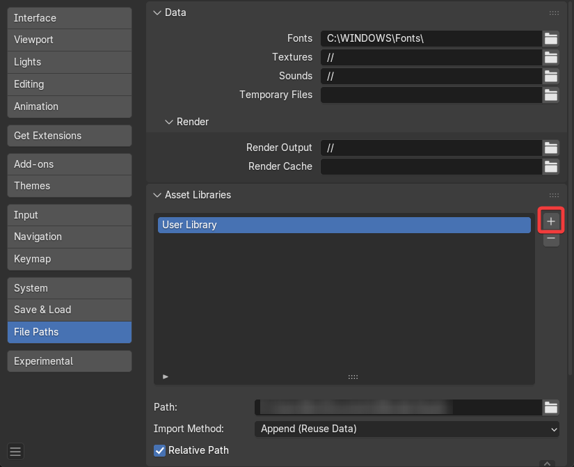
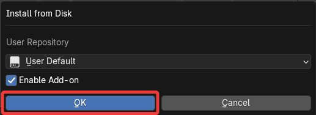

# Install

normalMagic is installed as an **asset library** in Blender. There is an optional **add-on** included with the Pro version that makes setting up the modifiers easier.

## Asset Library

!!! tip "TLDR"
    Download the **.zip**, extract to a folder, add the folder as an asset library.
    
    For more detailed instructions see below.

    !!! info "For more information on asset libraries you can check Blender's [Official Documentation](https://docs.blender.org/manual/en/dev/files/asset_libraries/introduction.html#introduction)"

1. Download latest .zip file for the closest Blender version (*normalMagic 4.5 v1.0.blend*).
2. Unzip/extract to a folder in your desired location.
3. Open Blender and go to **Edit/Preferences/File Paths/Asset Libraries.**
4. Click ++"\+"++ Add Asset Library. 
5. Navigate to the unzipped folder and press **Add Asset Library** (make sure you are in the root "normalMagic" folder, not the catalogs one). 
6. You should now see "normalMagic" in your asset libraries.  
**Optional**: Here you can choose how the data is imported in by default. See the [Official Documentation](https://docs.blender.org/manual/en/latest/editors/asset_browser.html#import-settings) for more information. 

normalMagic should now be installed. Modifiers will now show up under the **Add Modifier** menu. 

## Add-on

!!! tip "Pro version"
    The normalMagic add-on is available to the **Pro** tier only.

    [Add-on Documentation](./add-on/index.md)

To install the add-on simply:

1. Download the latest "addon" .zip file.
2. Drag the .zip file into Blender and press ++"OK"++. 

