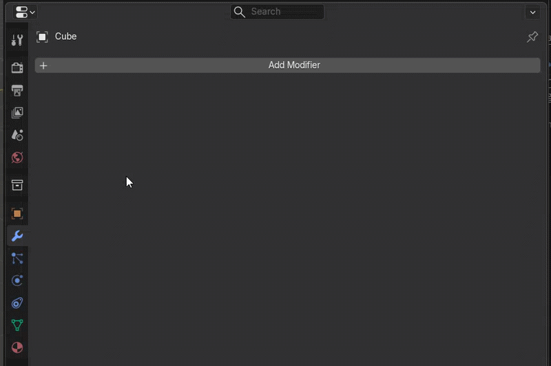
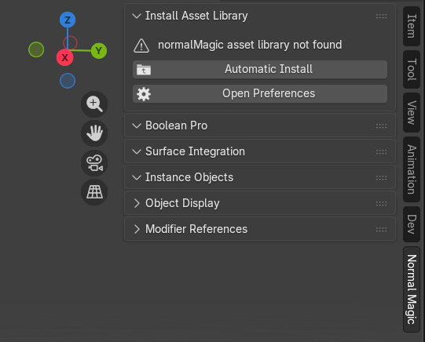
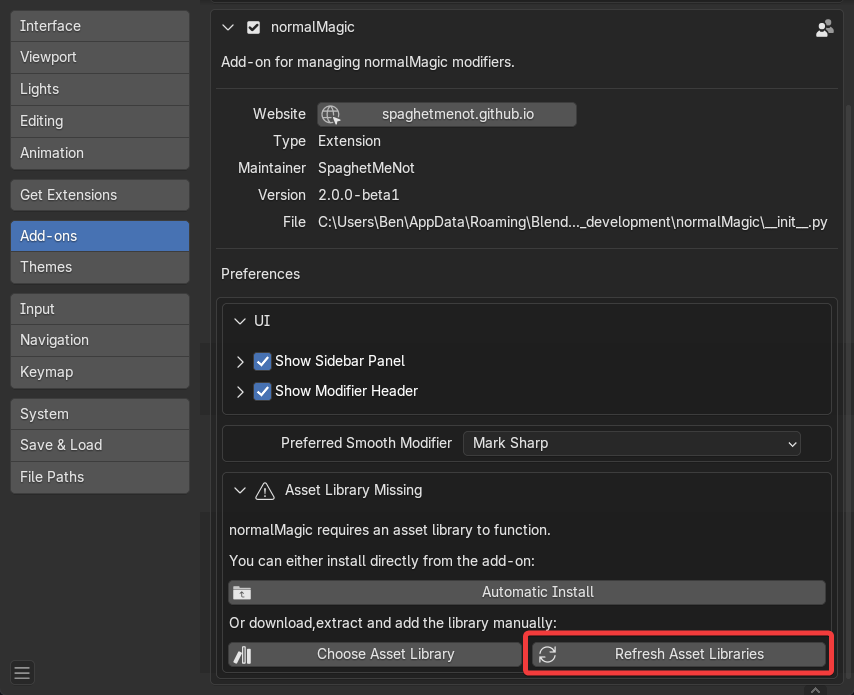

# Install

To install normalMagic please see the relevant section for your version:

[**Base Version**](#base-version-asset-library) is installed as an **asset library.**

[**Pro Version**](#pro-version-add-on) is installed as an **add-on** (that is packaged with the asset library).

## Base Version (Asset Library)

The Base version of normalMagic is installed as an **asset library**, not an add-on.

!!! tip "TLDR"
    Download the **.zip**, extract to a folder, add the folder as an asset library.
    
    For more detailed instructions see below.

    !!! info "For more information on asset libraries you can check Blender's [Official Documentation](https://docs.blender.org/manual/en/dev/files/asset_libraries/introduction.html#introduction)"

### First Time Install

1. Download latest .zip file for the closest Blender version (*normalMagic 4.5 v1.0.blend*).
2. Unzip/extract to a folder in your desired location.
3. Open Blender and go to **Edit/Preferences/File Paths/Asset Libraries.**
4. Click ++"\+"++ Add Asset Library. 
5. Navigate to the unzipped folder and press **Add Asset Library**. 
6. You should now see "normalMagic" in your asset libraries.  
**Optional**: Here you can choose how the data is imported by default. Setting this to **Pack** or **Link** will make it easier to update versions. **Link** will also reduce file sizes. See the [Official Documentation](https://docs.blender.org/manual/en/latest/editors/asset_browser.html#import-settings) for more information. 

normalMagic should now be installed. Modifiers will now show up under the **Add Modifier** menu:

### Update Asset Library

To update to a newer version of the normalMagic asset library:

1. Remove existing asset library under **Edit/Preferences/File Paths/Asset Libraries.**
2. Repeat [install instructions](#first-time-install) to add new version.

Alternatively you could replace the files in the existing library with the newer ones.

----

## Pro Version (Add-on)

!!! tip "TLDR"
    Download the add-on **.zip** file and drag it into Blender's viewport. For more detailed instructions see below.

### Install Add-on
To install/update the add-on simply:

1. Download the latest "addon" .zip file.
2. Drag the .zip file into Blender and press ++"OK"++.   
    You should now see a "Normal Magic" tab in the sidebar of the 3D viewport. 
3. Press ++"Automatic Install"++ to install the asset library from the add-on, or ++"Open Preferences"++ to add the asset library from elsewhere (See the next section).

### Custom Asset Library Location
If you want your asset library imported from another location:

1. Install the asset library.
    - Through the ++"Choose Asset Library"++ button in the add-on's Preferences.
    - Through **Edit/Preferences/Filepaths** (see [Base Version](#base-version-asset-library) instructions).
2. Refresh Asset library location, or restart Blender.  
    

### Update Add-on

Simple drag the new .zip file into Blender, this will update the existing version.

---- 

## Update Existing Scenes
Modifiers that already exist in scenes might need updating depending on your asset library setup.

### Linked/Packed Library
Update modifiers in existing scenes if **library is set to "Link"**:

1. Go to the outliner and change the view to "Blend File".
2. Locate the normalMagic file.
3. Right Click/Relocate.
4. Select .blend file in the current asset library path.

{ width=512 }

### Appended Library

Update modifiers in existing scenes if **library is set to "Append"**:

1. Add new version of modifier somewhere in your scene.
2. Go to the outliner and change the view to "Blend File".
3. Find the modifier under "Node Groups".
4. Right Click/Remap Users.
5. Select the newer version (most likely called ".001").

{ width=512 }