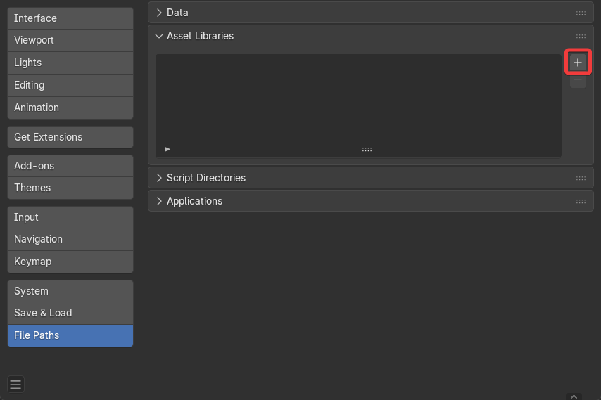
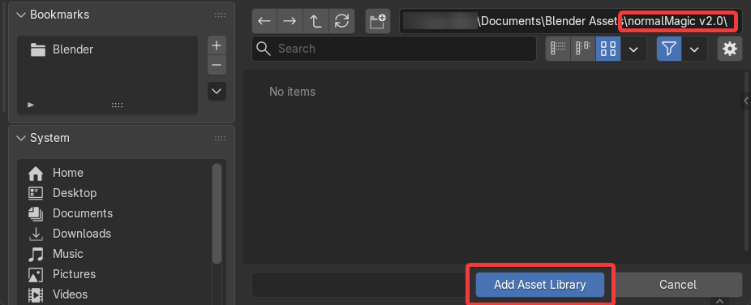
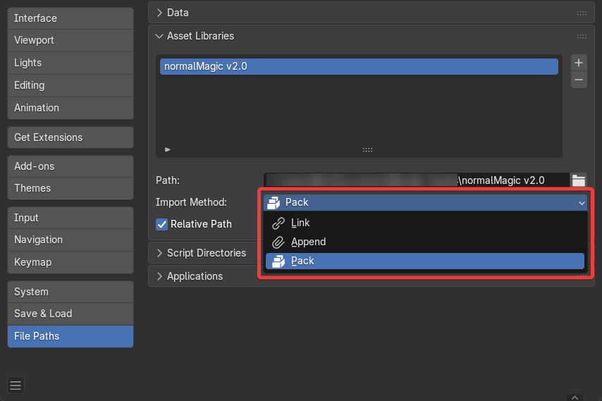
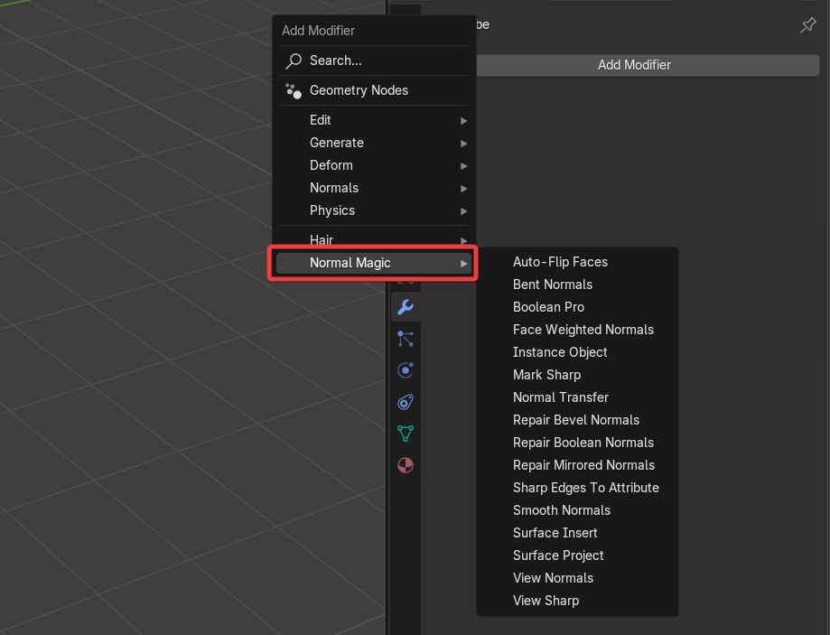
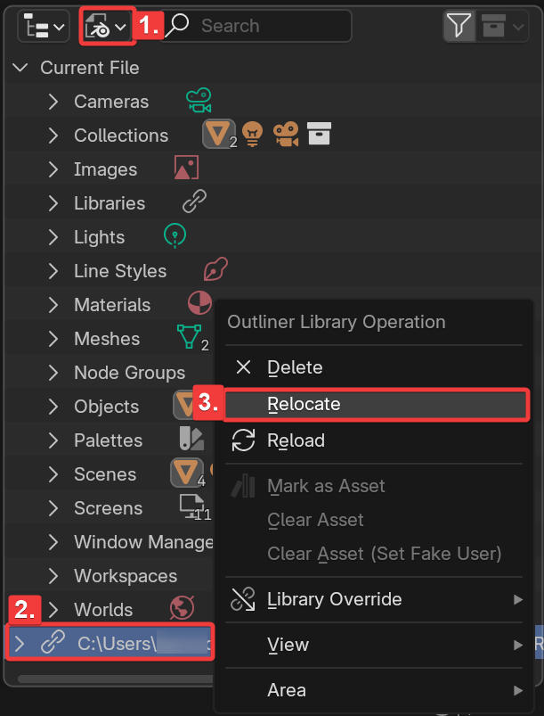
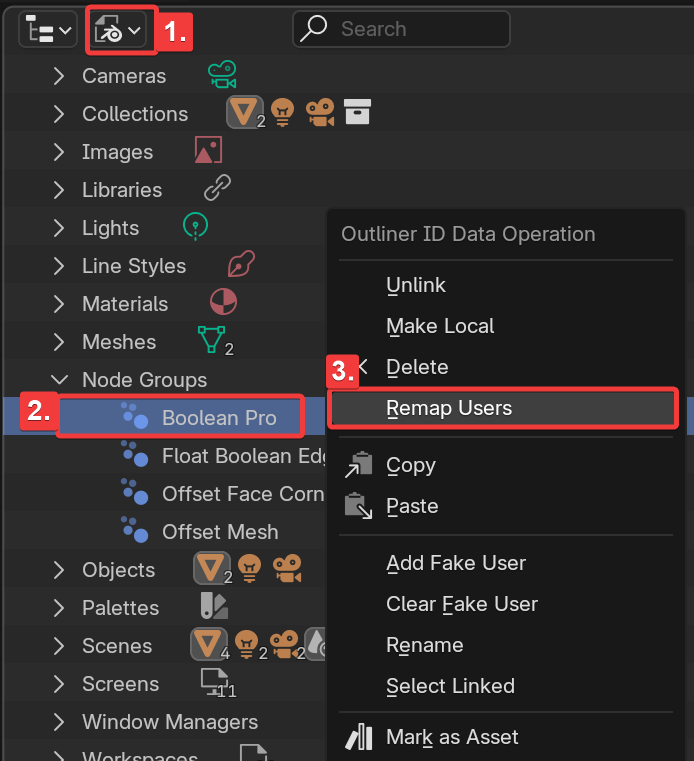
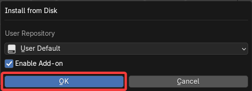
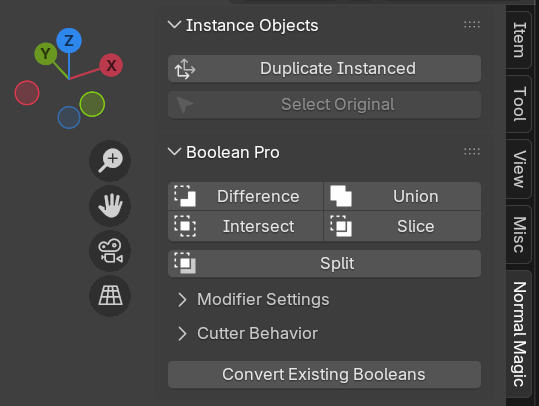

# Install

normalMagic is installed as an **asset library** in Blender. There is an optional **add-on** included with the Pro version which makes it easier and faster to set up certain modifiers.

Timestamped install video:
<iframe width="900" height="390" src="https://www.youtube.com/embed/JhmOyhYI4zM?si=lt3rrJaOTV8b3G8s&amp;start=100" title="YouTube video player" frameborder="0" allow="accelerometer; autoplay; clipboard-write; encrypted-media; gyroscope; picture-in-picture; web-share" referrerpolicy="strict-origin-when-cross-origin" allowfullscreen></iframe>

## Asset Library

!!! tip "TLDR"
    Download the **.zip**, extract to a folder, add the folder as an asset library.
    
    For more detailed instructions see below.

    !!! info "For more information on asset libraries you can check Blender's [Official Documentation](https://docs.blender.org/manual/en/dev/files/asset_libraries/introduction.html#introduction)"

### First Time Install

1. Download latest .zip file for the closest Blender version (*normalMagic 4.5 v1.0.blend*).
2. Unzip/extract to a folder in your desired location.
3. Open Blender and go to **Edit/Preferences/File Paths/Asset Libraries.**
4. Click ++"\+"++ Add Asset Library. 
5. Navigate to the unzipped folder and press **Add Asset Library**. 
6. You should now see "normalMagic" in your asset libraries.  
**Optional**: Here you can choose how the data is imported by default. Setting this to 'Link' will reduce file sizes and make it easier to update versions. See the [Official Documentation](https://docs.blender.org/manual/en/latest/editors/asset_browser.html#import-settings) for more information. 

normalMagic should now be installed. Modifiers will now show up under the **Add Modifier** menu. 

### Update Version

To update to a newer version of normalMagic:

1. Remove existing asset library under **Edit/Preferences/File Paths/Asset Libraries.**
2. Repeat [install instructions](#first-time-install) to add new version.

### Update Existing Modifiers

#### Linked Library
Update modifiers in existing scenes if **library is set to "Link"**:

1. Go to the outliner and change the view to "Blend File".
2. Locate the normalMagic file.
3. Right Click/Relocate.
4. Select .blend file in the current asset library path.

{ width=512 }

#### Appended Library

Update modifiers in existing scenes if **library is set to "Append"**:

1. Add new version of modifier somewhere in your scene.
2. Go to the outliner and change the view to "Blend File".
3. Find the modifier under "Node Groups".
4. Right Click/Remap Users.
5. Select the newer version (most likely called ".001").

{ width=512 }

## Add-on

!!! tip "Pro version"
    The normalMagic add-on is available to the **Pro** tier only.

    [Add-on Documentation](./add-on/index.md)

To install/update the add-on simply:

1. Download the latest "addon" .zip file.
2. Drag the .zip file into Blender and press ++"OK"++. 

You should now see a "Normal Magic" tab in the sidebar of the 3D viewport.

