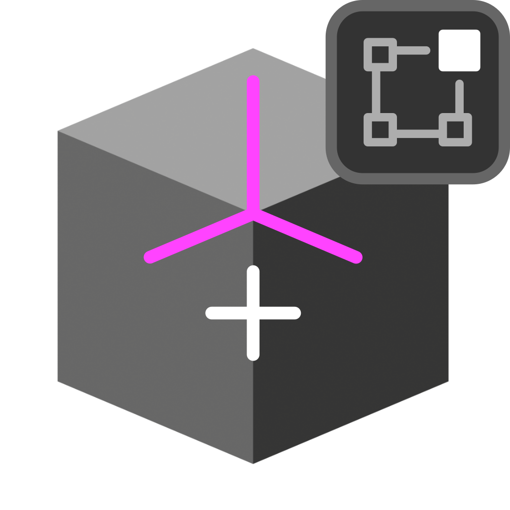

# Add Custom Normals

{width=128}

Adds custom normals to selected mesh object. Internally uses the [Lock Normals](../normal_tools/lock_normals.md) tool.

## Options

- **Normal Type:** How to store custom normals:
    - **Free:** Store custom normals as simple vectors in the local space of the mesh. This is efficient and fast to evaluate but does not support deformation.
    - **Tangent Space:** Store normals in a deformation dependent custom transformation space. This method is slower, but can be better when subsequent operations change the mesh without handling normals specifically.

- **Normal Domain:** When ***Custom Normal Type*** is set to ***Free***:
    - **Face Corner.** Store normals on face corners, allows for sharp edges.
    - **Point.** Store normals on points, cannot have sharp edges.