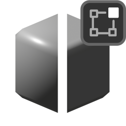

# Recalculate Normals

{width=128}

Found in the **Mesh/Normals** ++"alt"++ + ++"N"++ menu in "Edit Mode".

Calculated weighted normals and mark sharp for selected geometry. This is a tool version of the [Face Weighted Normals](../normal_tools/face_weighted_normals.md) and [Mark Sharp](../other_tools/mark_sharp.md) modifiers.

