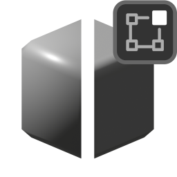

# Recalculate Weighted

{width=128}

Calculated weighted normals for selected geometry in "Edit Mode". This is a tool version of the [Face Weighted Normals](../normal_tools/face_weighted_normals.md) modifier.

This can be found in the **Normal Magic** Menu when editing meshes.

