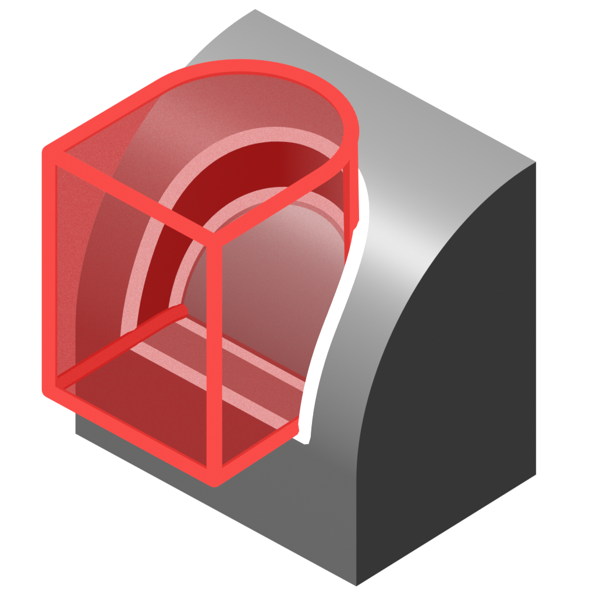
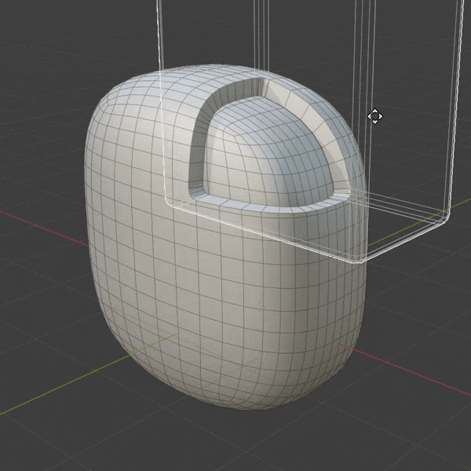
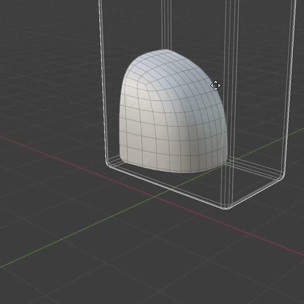
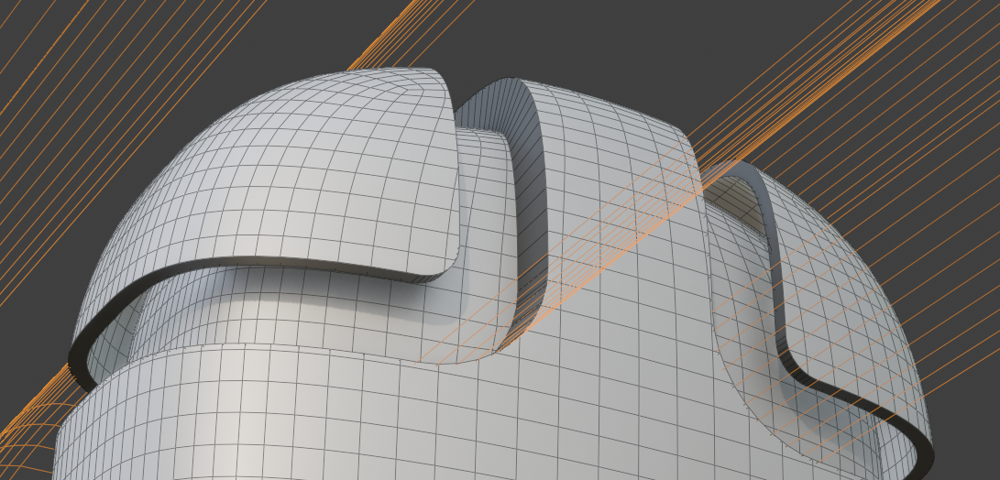

# Boolean Extrude

{ width=128 }

Cuts and extrudes where cutter meshes intersect.

## Extrusion Operation

- ####**Emboss**   

Slice mesh and extrude intersection faces in or out.
- ####**Panel** 

Perform an "Intersect" Boolean and extrude the result into a solid panel.

!!! tip "Equal and Opposite"
    These two operations are essentially the inverse of each other. Duplicating the object and using opposite operations with different outsets can create interesting effects.

    

## Examples

Please check out the [examples file](../examples.md) to see Boolean Extrude in action.

## Options

### Cutters
This section specifies which cutters to use.

- **Objects/Collection:** Choose individual mesh objects or a collection containing mesh objects.
- **Object Count:** How many cutter mesh objects to use (when in ***Objects*** mode).
- **Cutter Outset:** Expands the cutter mesh with options for [even thickness](../common_settings.md#even-thickness).

### Extrude
Control the extrude operation.

- **Operation:** Choose between Emboss/Panel operations:
    - **Emboss Surface:** Slice mesh and extrude intersection faces in or out.
    - **Panel:** Perform an "Intersect" Boolean and extrude the result into a solid panel.
- **Amount:** Distance to extrude.
- **Extrusion Method:** How to generate extrusion:
    - **Extrude Faces:** Extrude intersection area(s) along surface normal. The rim is a strip of quads perpendicular to original surface with options to inset the cut area.
    - **Offset Boolean:** Offset surface and cut with Boolean cutter(s). The rim is aligned to cutter(s) and there are no options to inset the cut area.
- **Offset Even:** Use [even thickness](../common_settings.md#even-thickness) settings on extrusion.
- **Boolean Solver:** Boolean solver to use internally.

### Inset 
(***Extrude Faces*** mode only). Inset the front of the extrude operation.

- **Scale:** Scale extruded faces around their average position.
- **Inset:** Inset extruded faces away from the extrusion boundary.
- **Edge Falloff:** Falloff distance from the edge of the inset. Use to smooth errors at the edge of the inset.

### Normals

- **Transfer Normals:** Transfer normals from source geometry. Produces the best normals.
- **Rim Sharp Angle:** Mark edges as sharp on the extrusion rim if they exceed this angle.

### Weld

Weld points by distance