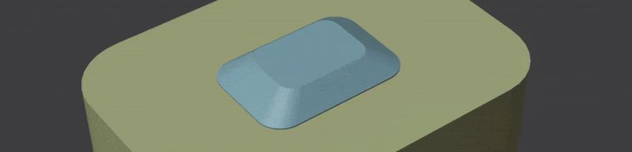
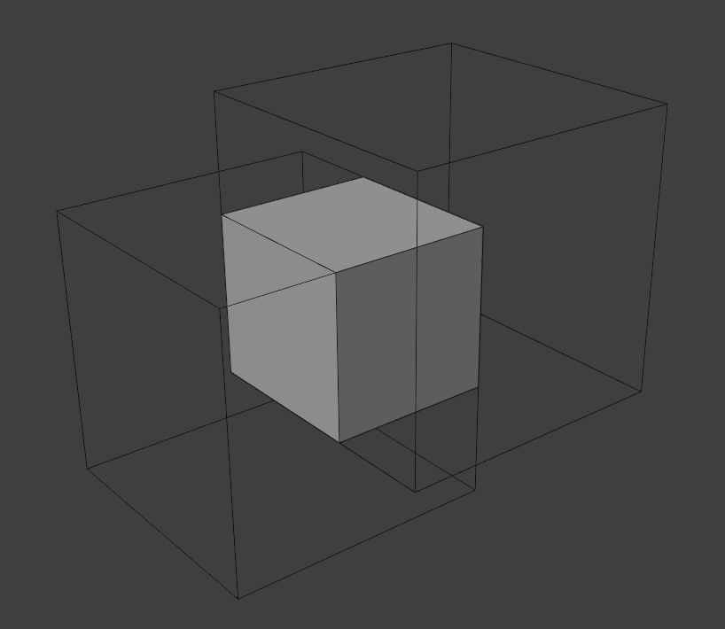
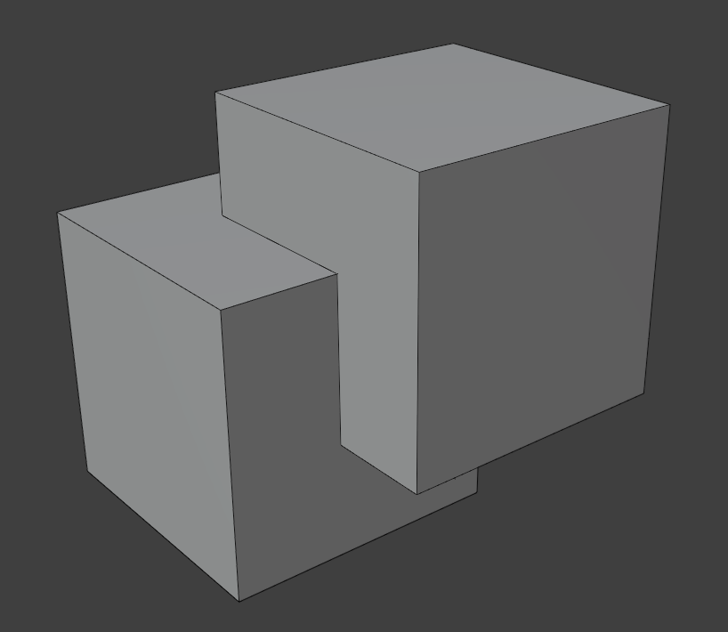
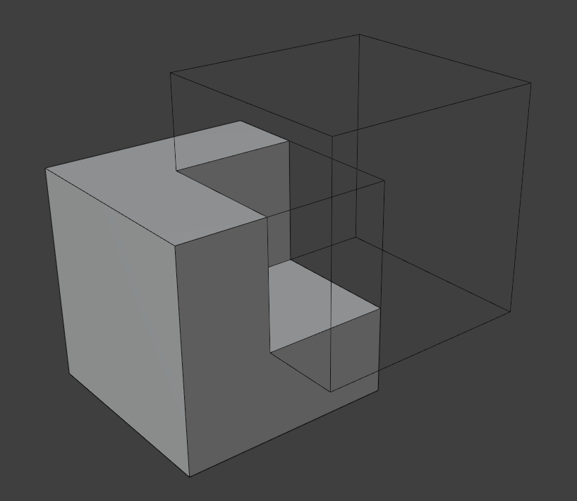

# Boolean Pro

{ width=128 }

Boolean Pro is designed to act as a replacement for Blender's built-in boolean modifier with extra functionality. For reference here is the  documentation for Blender's built-in modifier: [Documentation](https://docs.blender.org/manual/en/latest/modeling/modifiers/generate/booleans.html)

!!! tip "Add-on"
    The normalMagic add-on (Pro version) includes operators to quickly set up the Boolean Pro modifier, similar the the Bool Tool add-on.

    [normalMagic Add-on](../add-on/index.md)

The most powerful feature is transferring the normals automatically from boolean inputs for perfect boolean normals:

The cutter object can be given an outset (expanded) with even thickness before cutting:

There is also a ***Slice*** operation with optional inset:

| Intersect | Union | Difference | Slice |
|---|---|---|---|
| || ||

## Options

### Main

- **Operation.** Which boolean operation to perform.
    - **Intersect.** Keep the part of the mesh that is shared between inputs.
    - **Union.** Combine input meshes into a single mesh.
    - **Difference.** (Default) Subtract input meshes from source mesh.
    - **Slice.** Slice source mesh with input meshes. This combines "Intersect" and "Difference" into the same output.
- **Object.** Mesh object to use for boolean operation.
- **Collection.** Collection containing mesh objects to use for boolean operation.
- **Solver.**
    - **Float.** Simple solver with good performance.
    - **Exact.** Slower solver with best results on coplanar faces.
    - **Manifold.** (Default) Fastest solver that works only on manifold meshes but gives better results.
- **Outset.** Expands the cutter mesh with even thickness.
- **Inset (Slice Mode).** Offsets the cutter inwards for the intersect boolean to give a gap between meshes.

### Weld

- **Merge by Distance.** Merge vertices based on distance
- **Distance.** Distance at which to merge vertices

### Shading

- **Materials.** How to assign materials to new faces.
    - **Index Based.** Match material index from boolean meshes.
    - **Specify.** Specify a material to apply to all new faces.
    - **Transfer.** Transfer materials from boolean meshes. This might not be accurate when using collections.
- **Transfer Normals.** Use normals from input meshes. Produces the best normals.
- **Mark Sharp.** Mark all intersection edges between meshes as sharp.

### Solver Options

- **Result.** Whether to output a solid object or a cut surface.
    - **Solid.** Output full Boolean result.
    - **Surface.** Output a cut surface with open edges where new faces would appear.
- **Sequential (Float solver only).** Perform Booleans one mesh island at a time. This can often give better results but can be slower.
- **Self Intersection (Exact solver only).** Correctly calculates cases when one or both operands have self-intersections. This involves more calculations making the node slower.
- **Hole Tolerant.** Optimizes the Boolean output for Non-manifold geometry at the cost of increased computational time. Because of the performance impact, this option should only be enabled when the solver demonstrates errors with non-manifold geometry.

