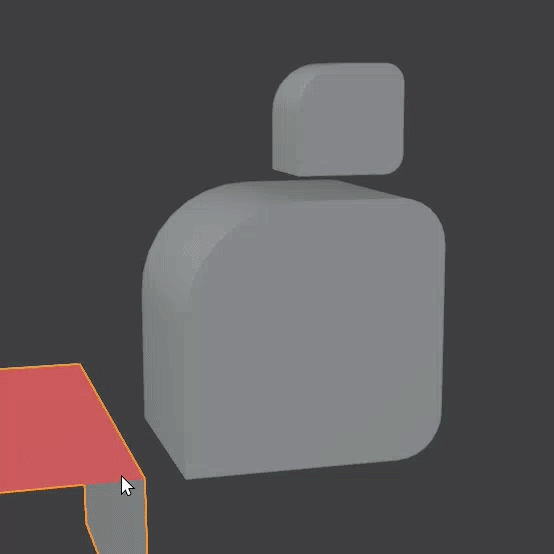
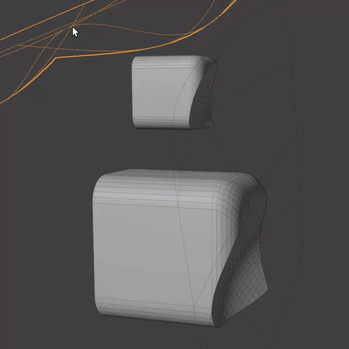
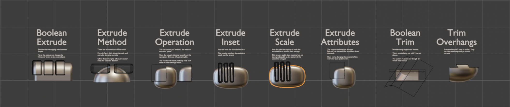

# Boolean Trim

{ width=128 }

Cut and 'Trim' a mesh using single-sided cutter object(s).

- 
Trim plane(s) can turn corners
- 
Multiple trim planes can be used with one modifier

## Requirements

- Trim plane(s) must be single sided.
- Trim plane(s) must extend through the entire mesh.

## Examples

Please check out the [examples file](../examples.md) to see Boolean Trim in action.

## Options

### Trim Planes

- **Objects/Collection:** Choose individual mesh objects or a collection containing mesh objects.
- **Object Count:** How many mesh objects to insert (when in ***Objects*** mode).

### Trim

- **Reverse Trim Direction.** Trim faces on the opposite side of the trim plane(s).
- **Solver.** The Boolean solver to use for the trim operation.
- **Un-Sliced Islands.** What to do with mesh islands that aren't sliced by the Boolean operation:
    - **Trim Per Island.** Delete un-sliced mesh islands based on the direction of the nearest cutting plane(s).
    - **Keep All.** Keep all un-sliced mesh islands.
    - **Remove All.** Remove all un-sliced mesh islands.
- **Offset.** Offset the trim plane(s) with even offset.
- **Result.** 
    - **Solid.** Output solid mesh if possible. Trimmed section is filled.
    - **Surface.** Output single-sided mesh. Trimmed section is removed.

### Advanced

- **Plane Extrusion.** How much the trim plane is extruded before the Boolean operation.

## How it Works

1. Trim planes are extruded into solid shapes by a tiny amount in the opposite direction to the trim operation.
- These shapes are used for a difference Boolean on the main mesh.
- Mesh islands on the trimmed side are deleted.