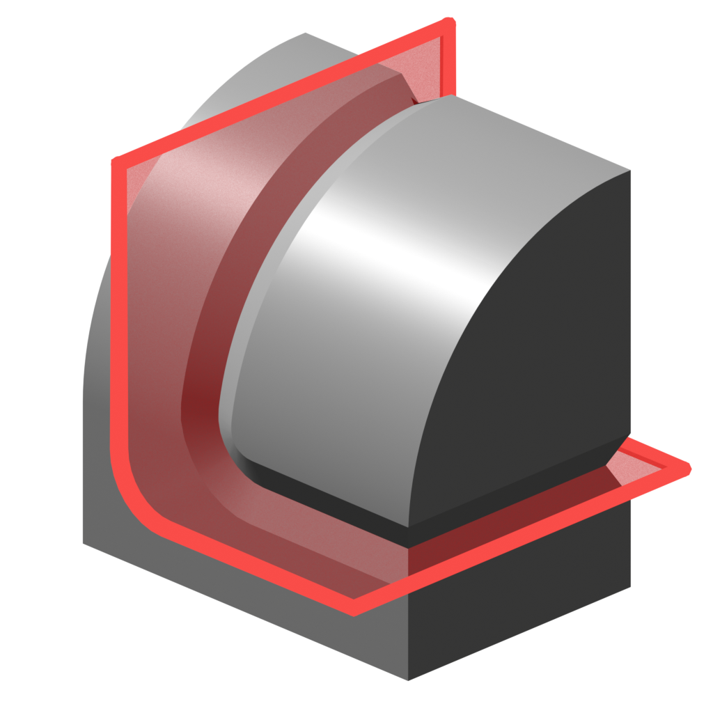
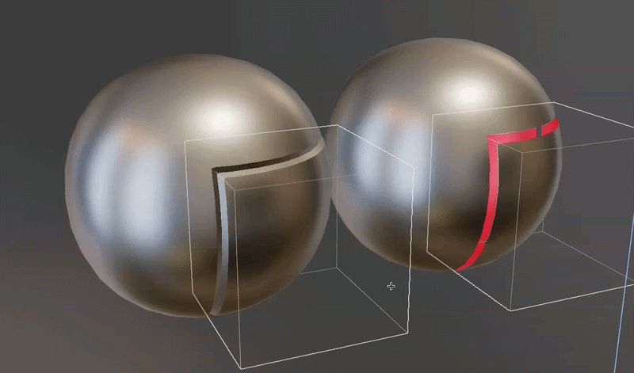
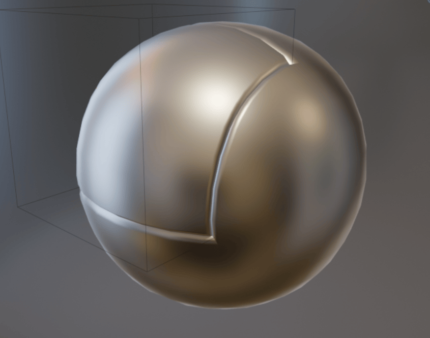

# Cut Groove

{ width=128 }

Cut a v-shaped groove or a gap into a surface along the intersection of cutter objects.

## How it works

The **Cut Groove** Modifier performs the following steps:

1. Generate a curve from the intersection of cutter objects.
- Convert the curve to a 'ribbon' mesh that follows the surface closely.
- Extrude the 'ribbon' mesh with a v-shaped profile to create a solid 'groove cutter'.
- Cut the 'groove cutter' from the original surface using a difference Boolean.

!!! tip "Viewing Steps"
    You can view the result of each of the above steps using the [Debug panel](#debug)

## Options

### Cut Operation
- **Groove:** Cut a V-shape channel into geometry where cutters intersect. This should keep meshes manifold.
- **Gap:** Cut a gap of even width where cutters intersect. This will create non-manifold geometry.

### Cutter Objects
This section specifies which cutters to use.

- **Objects/Collection:** Choose individual mesh objects or a collection containing mesh objects.
- **Object Count:** How many cutter mesh objects to use (when in ***Objects*** mode).
- **Cutter Outset:** Expands the cutter mesh with options for [even thickness](../common_settings.md#even-thickness).

### Cutter Geometry
Control how the groove cutter is generated. This can be previewed using the "Final Cutters" [debug view](#debug).

- **Width:** Width of the cut.
- **Groove/Cutter Depth:** How deep to make the cutter.
- **Cutter Boundary Weld:** Distance at which to weld points along the cutter boundary. This is useful for avoiding bad shading and mesh errors along the cut boundary.
- **Edge Slide Angle:** Slide cutter edges along base mesh edges if they are within this angle.

### Intersection Curve
Control over the curve generated at cutter intersection. This can be previewed using the "Intersection Curve" [debug view](#debug).

- **Line Solver:** Which Boolean solver to use to generate the curve.
- **Simplify Curve:** Remove inline points from curve.
- **Distance Weld:** Weld points closer than this threshold.

### Boolean
Settings for final Boolean where groove mesh is cut into the object's surface.

- **Non-Manifold Solver:** Which Boolean solver to use when one or more inputs is not manifold.
- **Merge By Distance:** Merge Vertices by distance after Boolean operation.

### Normals
How to calculate normals.

- **Transfer Normals:** Transfer normals with the Boolean operation. It is recommended to keep this on to avoid shading artifacts.
- **Match Boundary Normals:** Match the normals on the edge of the groove. This makes the sharp edge appear rounded. 
- **Groove Sharp Angle:** Angle at which to mark edges as sharp on the groove faces.

### Groove UVs
For "Groove" operation only.

- **Method:** How to generate UVs:
    - **Inherit Surface UVs:** Project UVs from original surface.
    - **UV Strip:** Generate new UVs in a strip along the groove.
- **UV Map:** UV Map to write to.

### Debug
This section lets you inspect the [steps](#how-it-works) of the process if the modifier isn't behaving as expected.

- **View.** Outputs geometry from different points in the node graph.

    !!! warning
        This changes the output of the graph, make sure to turn off when you're done inspecting.
    - **Intersection Curve:** Output the curve generated by the Boolean intersection.
    - **Ribbon:** Output the extruded curve or "ribbon".
    - **Final Cutters:** Output the 'groove cutter' extruded from the 'ribbon'.