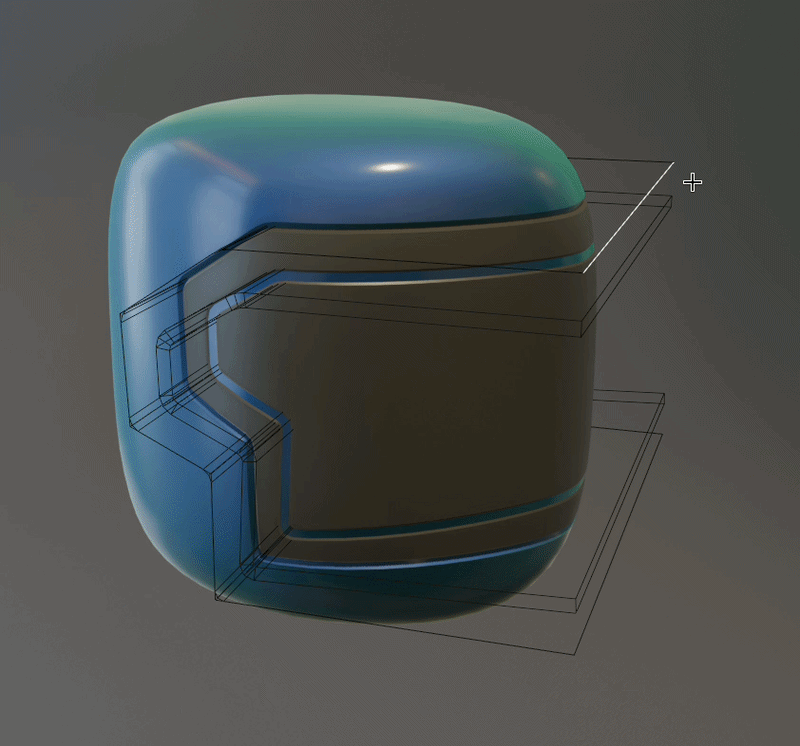

# Offset Surface

{ width=128 }

Offset the surface of a mesh in or out with options for even thickness. 

!!! tip "Re-using cutters"
    This can be useful when re-using the same mesh object to perform multiple cuts/operations.

    Here we're using the same basic cutter to perform two cuts:
    
    - The base mesh has a bevel and is used for a [Cut Groove](../mesh_tools/cut_groove.md) modifier.
    - A linked duplicate is then using Offset Surface before the bevel then a [Solidify Pro](../mesh_tools/solidify_pro.md) and is used for a [Boolean Extrude](../mesh_tools/boolean_extrude.md) modifier.

    

## Options

- **Distance:** Distance to offset surface.
- **Even thickness:** Method for [even thickness](../common_settings.md#even-thickness).
- **Direction:** Direction of offset:
    - **Normal:** Normal stored on geometry. Will use custom normals if they exist.
    - **True Normal:** Geometric normal (ignores custom normals).
    - **Custom:** Custom direction (Specify).

### Selection

See [selection settings](../common_settings.md#selection).
    