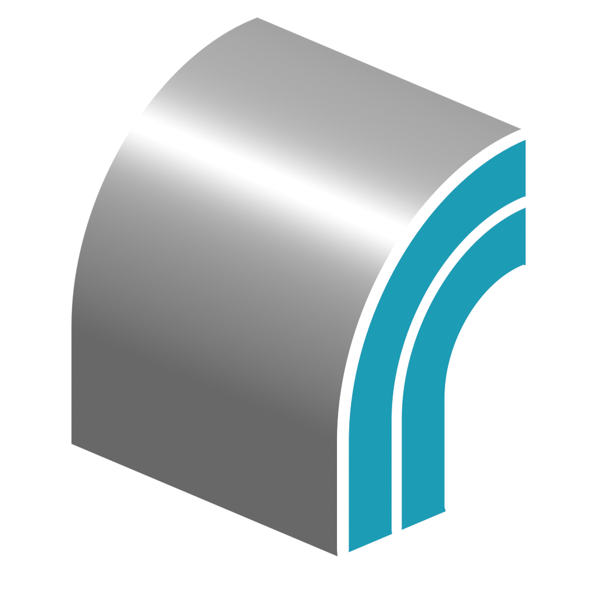

# :construction: Solidify Pro

{ width=128 }

An alternative to Blender's [Solidify Modifier](https://docs.blender.org/manual/en/latest/modeling/modifiers/generate/solidify.html), **Solidify Pro** offers several advantages:

1. Custom normal support.
2. Edge loops.
3. Custom profile.
4. Inset control.
5. More creasing control on the rim.
6. Match Boundary normals.
7. UV settings.

## Current Limitations
Not all the settings of Blender's native "Solidify" modifier have been replicated yet. The notable exclusions are:

- **Vertex Group / Selection**. Solidify Pro applies to the whole mesh.
- Complex mode **Boundary** control. Boundaries are extruded along the surface normal.
- Float control of **Bevel Weight**. Bevel weight can be set on/off by using the output attribute ***Boundary Edges***. This attribute can then be specified in a subsequent bevel modifier.