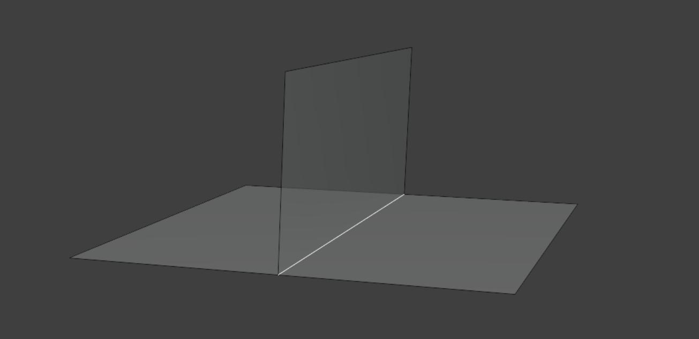
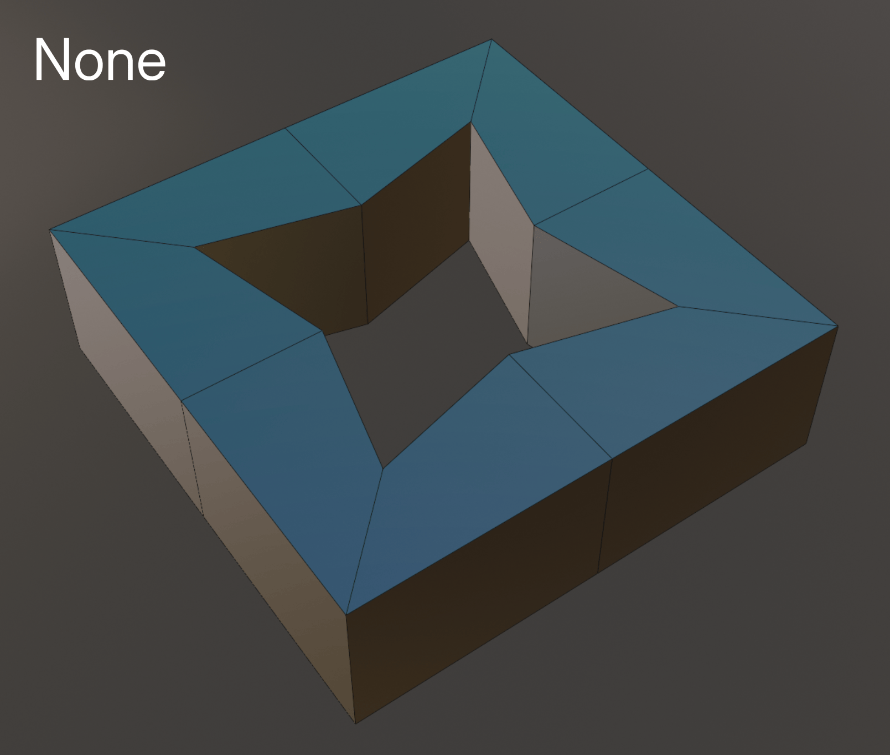
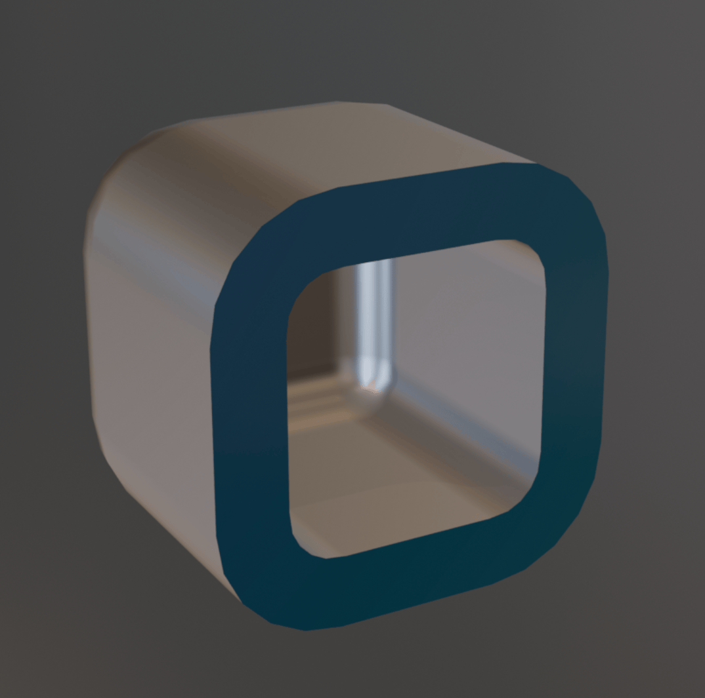

# Solidify Pro

{ width=128 }

**Solidify Pro** offers several advantages to Blender's [Solidify Modifier](https://docs.blender.org/manual/en/latest/modeling/modifiers/generate/solidify.html):

1. Custom normal support.
2. Edge loops.
3. Custom profile control.
4. Inset control.
5. More creasing control on the rim.
6. Match Boundary normals.
7. UV settings.
8. Front/Back/Rim exclusion/output attributes.

## Examples
Be sure to check out the [examples file](../examples.md) to see Solidify Pro in action.

## Current Limitations
Not all the settings of Blender's native "Solidify" modifier have been replicated yet. The notable exclusions are:

- Cannot solidify edges with more than two faces. This is possible with "Complex" mode in the native modifier. 
- Float control of **Bevel Weight**. Bevel weight can be set on/off by using the output attribute ***Boundary Edges***. This attribute can then be specified in a subsequent bevel modifier.

## Options

- **Thickness:** Thickness of solidify operation.
- **Offset:** Offset the thickness from the center.
- **Direction:** Direction to extrude:
    - **Normal:** Normal stored on geometry. Will use custom normals if they exist.
    - **True Normal:** Geometric normal (ignores custom normals).
    - **Custom:** Custom direction (Specify).
- **Even Thickness:** Method for calculating even thickness. See [even thickness settings](../common_settings.md#even-thickness) for more information.

### Output Geometry
In this section you can choose which parts of the solidify operation to keep.

!!! tip "Offset Surface"
    If you only plan on keeping the front/back of the solidify operation, consider using [Offset Surface](../mesh_tools/offset_surface.md) as it's much faster.

### Inset

Inset the front or back faces from their boundary edge.

- **Amount:** Distance to inset faces.
- **Edge Falloff:** Falloff distance from the edge of the inset. Use to smooth errors at the edge of the inset.
- **Scale:** Scale faces around their average position. More stable than insetting but can be harder to control.

### Rim Geometry

Control the shape of the geometry created along the rim.

- **Rim Profile:** Shape of the rim profile:
    - **Linear:** Flat rim with even edge loops.
    - **V-Shape:** Specify an angle for a "v-shape" profile.
    - **Round:** Round profile with even edge loops.
    - **Custom Curve:** Provide a curve object to apply as a rim profile.
- **Invert:** Invert the height of the profile.
- **Reverse:** Reverse the profile curve (swap left/right).

#### Profile Geometry
- **Profile Height:** How height is calculated along the rim profile:
    - **Consistent:** Rim profile is consistent height based on the specified thickness.
    - **Relative:** Rim profile will scale locally based on the distance between points.
    - **Specify:** Specify a value for profile height.

### Crease

Apply crease values to the rim.
- **Front:** Crease value to apply on the front boundary.
- **Back:** Crease value to apply on the back boundary.
- **Rim Crease:** Method for creasing perpendicular rim edges:
    - **Edge Angle:** Apply creases by edge angle.
    - **Signed Edge Angle:** Apply creases by convex/concave angles.
    - **Vertex Crease:** Use Vertex creaes values for edge creases.
- **Rim:** Crease value to apply to selected rim edges.

### Normals

Control normals and sharp edges.
- **Mark Sharp:** Mark solidified edges sharp.
- **Profile Angle:** Angle along the profile curve to mark sharp (along the rim).
- **Rim Angle:** Angle to mark sharp across the rim.
- **Extend Sharpness:** Extend sharp edges across the rim.
- **Match Boundary Normals:** Match normals along the rim boundary. Requires at least one edge loop.

### Materials

Specify material to use on rim, you can either set material by index or specify a material.

### UVs

Choose whether and how to generate UVs on rim faces

### Selection

Which faces to solidify. See [selection settings](../common_settings.md#selection) for more information.