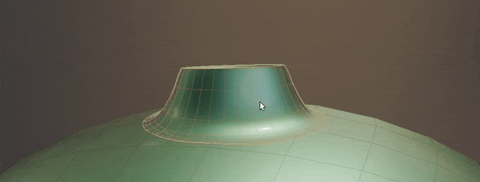
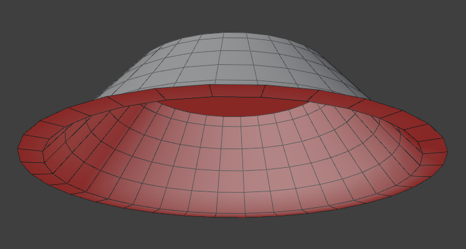
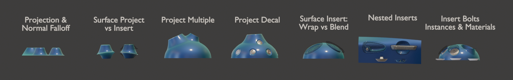

# Surface Project

{ width=128 }

Project and blend geometry onto another mesh's surface, transfer normals and UVs for a seamless blend.

Blend a mesh object to others. Multiple other mesh surfaces can be specified.

Project mesh as a "Decal" other objects. This flattens the geometry but keeps the original normals.

!!! tip "Open Edges"
    This modifier works best on meshes with "open edges" i.e. non-solid objects. These edges are used as the base for most [masking methods](../common_settings.md#mask-falloff)

    {width=512}

## Examples

Examples can be found in the **Surface Project/Insert** scene in the [example file](../examples.md)

## Options

### Transfer Objects

Choose which meshes to project to.

- **Object Count.** How many mesh objects to project to.
- **Objects.** Choose individual mesh objects to project to.
- **Collection.** Choose a collection containing mesh objects to project to.

### Shrinkwrap

Define how mesh is projected to surfaces.

- **Wrap Method.** Method for vertex projection:
    - **Nearest Surface.** Move vertices towards the closest point on target surface
    - **Project.** Project rays to collide with target surface.
    - **Project Decal.** Project rays to collide with target surface and flatten geometry while keeping normals. (Excludes projection masking options)
- **Surface Offset.** Move projected vertices a fixed amount towards or away from the target surface.

#### Projection Settings

- **Projection Direction.** Define direction to project rays.
    - **Object Direction.** Direction in object space (default is -Z).
    - **World Direction.** Direction in global space (default is -Z).
    - **Surface Normal.** Surface normal of the closest target surface.
    - **Mesh Island Normal.** Use the average normal of each mesh island.
    - **Surface Tangent.** Direction of surface at edge boundaries.

- **Ray Length.** Maximum distance target surface can be collided with.
- **No Hit.** Change behavior of vertices when projection rays miss:
    - **Unchanged.** Do not move vertex.
    - **Closest Surface to Max Dist.** Move vertex to the maximum distance in ray direction then snap to closest point on target surface.

#### Masking

Control how projection is masked. See [Mask Falloff](../common_settings.md#mask-falloff)

- **Vertex Group.** Choose a vertex group to project.

### Normals

Define how normals are transferred from target surfaces. This uses [Normal Transfer](../normal_tools/normal_transfer.md) under the hood. Normals are transferred after vertex projection using the closest target surface.

- **Normal Domain.** Whether normals are stored on points (smooth) or face corners (allows sharp edges).
- **Use Shrinkwrap Amount.** Use the same mask used for vertex [projection](#masking).
- **Amount.** Specify a Vertex Group or single value to choose how much normals are transferred.
- **Automatic Masking.** Use [mask falloff](../common_settings.md#mask-falloff) settings to make a new mask for transferring normals.

### UVs

Transfer UVs from target surface.

- **Transfer UVs.** Turn UV transfer on/off.
- **UV Map From.** Which UV Map to transfer from the **surface**.
- **UV Map To.** UV Map to write to on this object.

#### Selection

Limit UV transfer to specific faces

- **Selection.** Which faces to modify UVs for. Defaults to "on", applying to every face.
- **Material.** Limit UV modification to a specific material.
- **Invert Selection.** Inverts the selection to modify UVs on every face that isn't selected using the above options.

