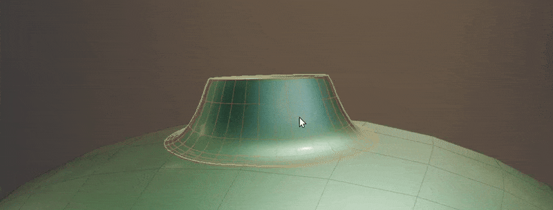
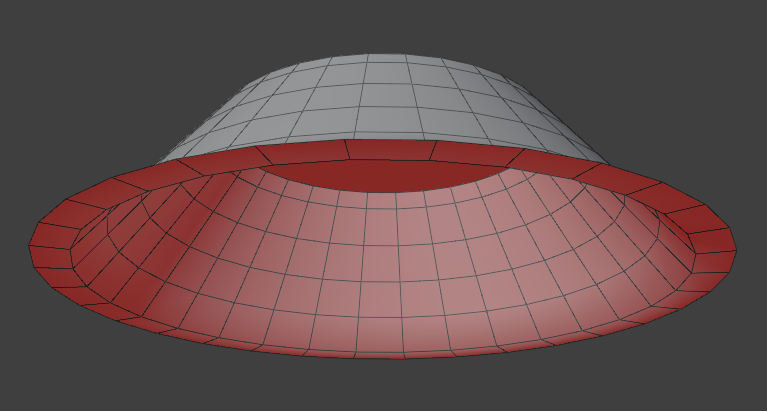
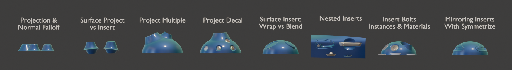
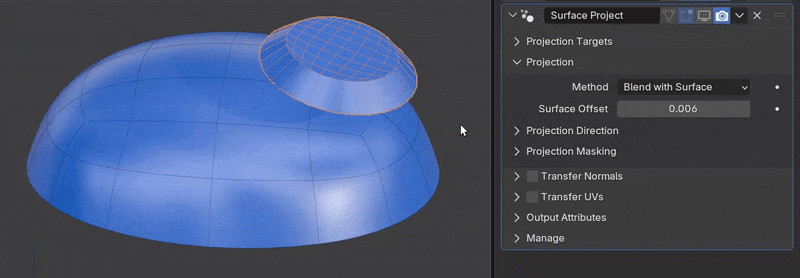
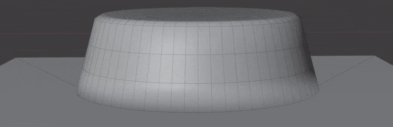

# Surface Project

{ width=128 }

Project and blend geometry onto other mesh surfaces. Transfer normals and UVs for a seamless blend.

-   
Blend a mesh object to other surfaces. Multiple other mesh surfaces can be specified.

-   
Project mesh as a "Decal" onto other objects. This flattens the geometry but keeps the original normals.

!!! tip "Open Edges"
    This modifier works best on meshes with "open edges", i.e. non-solid objects. These edges are used as the base for most [masking methods](../common_settings.md#mask-falloff).

    {width=512}

## Examples

Examples can be found in the **Surface Project/Insert** scene in the [example file](../examples.md).

## Options

### Projection Targets

Choose which meshes to project to.

- **Target Objects:** How many mesh objects to project to.
- **Objects:** Choose individual mesh objects to project to.
- **Collection:** Choose a collection containing mesh objects to project to.

### Projection

Define how mesh is projected to surfaces.

- **Method:** Method for vertex projection:
    
    - **Wrap to Surface:** Wrap mesh to target surface. Points will be projected to target surface and re-displaced based on their calculated height.
    - **Blend with Surface:** Project points to target surface then blend between original and projected positions.
    - **Project Decal:** Flatten geometry to target surface while keeping original normals. Ideal for "floaters" intended for baking.
- **Surface Offset:** Move projected vertices a fixed amount towards or away from the target surface.

#### Projection Direction

Control the direction and properties of surface projection.

- **Project Direction:** Define direction of projection rays:
    - **Object Direction:** Direction in object space (default -Z).
    - **World Direction:** Direction in world space (default -Z).
    - **Mesh Normal:** Use individual point normals.
    - **Mesh Island Normal:** Use the average normal of each mesh island.
    - **Mesh Tangent:** Use individual point tangents.
    - **Surface Normal:** Use the normal of the closest part of target surface.
- **Base Height:** How height is calculated for ***Wrap to Surface*** and ***Project Decal*** projection methods:
    - **Boundary Center:** Calculate height from a plane defined by the center of the boundary and the projection direction.
    - **Object Origin:** Calculate height from a plane defined by the objects origin and the projection direction.
- **Re-Displace:** When using ***Wrap to Surface***. Direction to apply calculated height:
    - **Projection:** Apply height displacement using the projection direction.
    - **Surface Normal:** Apply height displacement using the normal of the target surface.
- **Ray Length:** Maximum distance rays will collide with target surface. Best to keep at a large enough value that all points collide.
- **No Hit:** Change behavior of vertices when projection rays miss:
    - **Unchanged:** Do not move vertex.
    - **Closest Surface to Max Dist:** Move vertex to the maximum distance in ray direction then snap to closest point on target surface.

#### Projection Masking

Control how projection is masked. See [Mask Falloff](../common_settings.md#mask-falloff).

- **Vertex Group:** Choose a vertex group to project.

### Transfer Normals

Transfer normals from target surfaces. Internally this uses [Normal Transfer](../normal_tools/normal_transfer.md). Normals are transferred after vertex projection, using the closest target surface.

- **Normal Domain:** Whether normals are stored on points (smooth) or face corners (allows sharp edges).
- **Normal Masking:** How to mask the normal transfer:
    - **Projection Mask:** Use the same mask used for vertex [projection](#projection-masking).
    - **New Mask:** Create a new mask using [mask falloff](../common_settings.md#mask-falloff).
- **Vertex Group:** Limit all normal transfer to a vertex group.

### Transfer UVs

Transfer UVs from target surface.

- **UV Map From:** Which UV Map to transfer from the **surface**.
- **UV Map To:** Which UV Map to write to on this object.