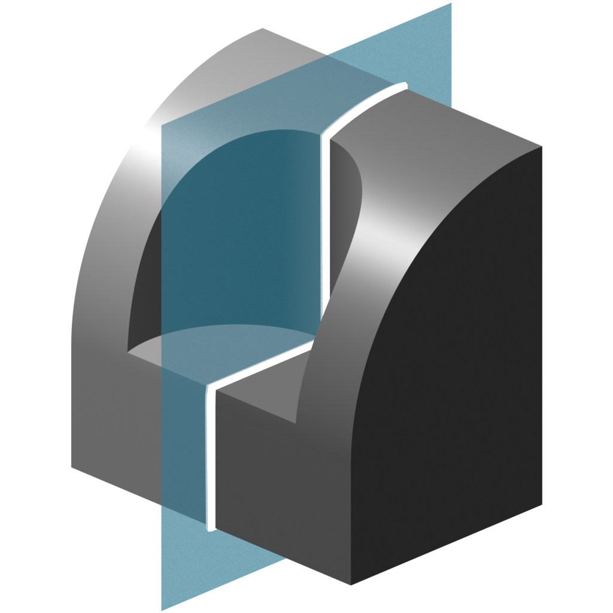
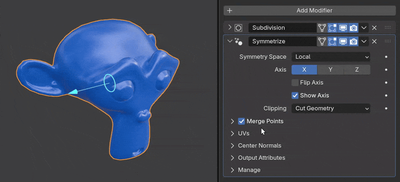

# Symmetrize

{ width=128 }

Mirrors a mesh on a single axis. Similar to Blender's [Mirror Modifier](https://docs.blender.org/manual/en/latest/modeling/modifiers/generate/mirror.html) but with the following improvements:

1. Correctly mirrors custom normals.
2. Optional gizmo for displaying the symmetry plane and direction.
3. Output attribute for mirrored faces.
4. Global space option without having to use another object.

The one disadvantage of Symmetrize is the limitation to a single axis. However, this can easily be overcome by using another symmetrize modifier.

## Options

- **Symmetry Space:** Coordinate space to use for symmetry.
    - **Local:** Symmetrize in object's local space (default mirror modifier behavior).
    - **Global:** Symmetrize in global space based on the world origin.
    - **Object:** Symmetrize using another objects position and rotation.
- **Axis:** Which axis to symmetrize on, relative to the ***Symmetry Space***.
- **Flip Axis:** Reverse direction of symmetry operation.
- **Show Axis:** Display location and direction of symmetry operation.
- **Clipping:** Clip geometry on the mirrored side of the symmetry plane.
    - **None:** No Clipping. All geometry will be mirrored across the symmetry plane.
    - **Snap Points:** Points on the mirrored side will be snapped to the symmetry plane.
    - **Cut Geometry:** Geometry will be sliced on the symmetry plane.

### Merge Points
Merge points by distance after symmetry operation.

### UVs
Options to flip and offset UVs.

- **UV Map:** Name of UV Map to edit.
- **Flip U:** Flip mirrored UVs horizontally.
- **Flip V:** Flip mirrored UVs vertically.
- **Offset:** Offset mirrored UVs.

### Center Normals

- **Mark Sharp:** Mark center edges as sharp based on angle.
- **Angle:** Minimum angle for a sharp edge.
- **Unify Custom Normals:** Face corner normals on center points will average. Sharp edges will be preserved. Only applies if custom normals exist on mesh.