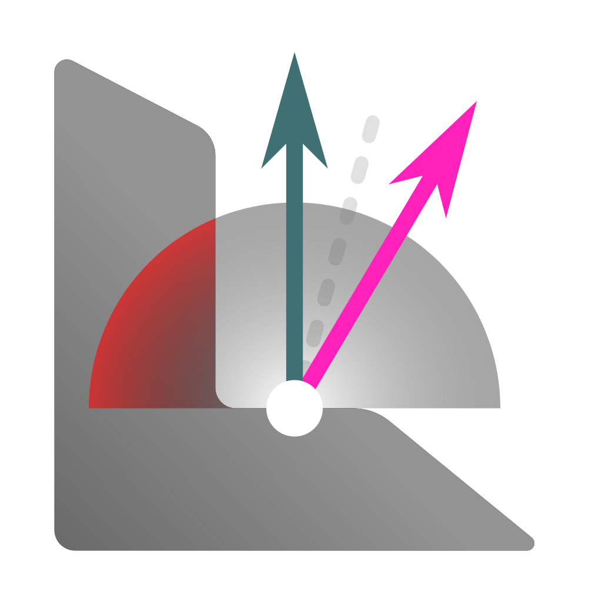
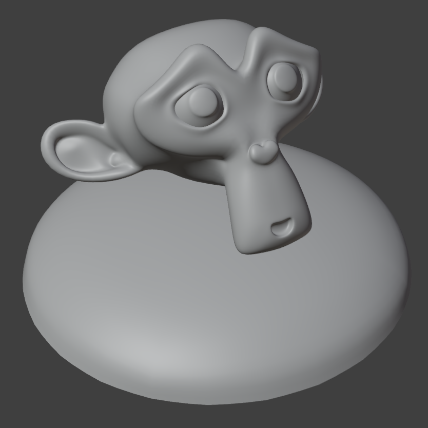
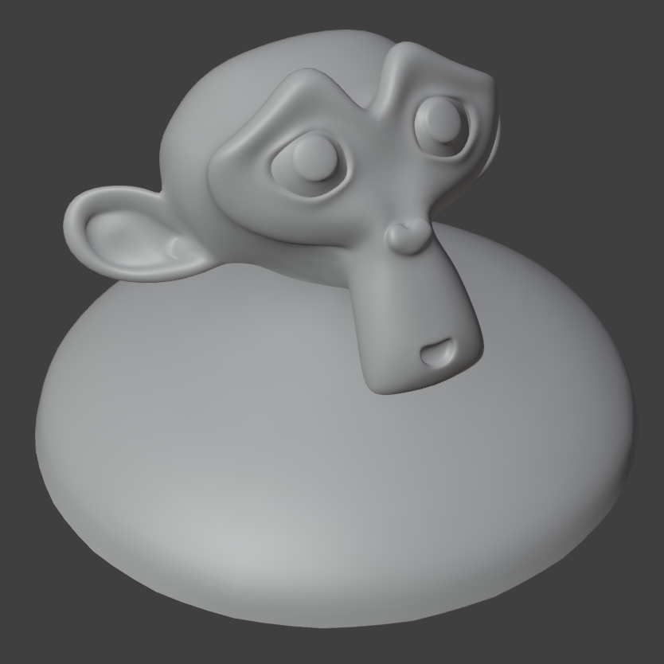

# Bent Normals

{width=128}

Bent normals can improve how surfaces react to ambient lighting, especially in non-path-traced renderers such as game engines.

Usually bent normals are baked to a texture but this modifier will calculate bent normals **directly on geometry**. A cone of rays is cast from each point and the normals are sampled and averaged to find the average direction of ambient light.

-   
**Bent normals off**  
Unnaturally dark shadows.

-   
**Bent normals on**  
Fake bounce light added to shadow areas.

## Options

- **Factor.** How much bent normals are mixed in with existing normals.

### Collision Geometry
Collide with other objects in the scene.

- **Object.** Object to collide rays with.
- **Collection.** Collection to collide rays with.

### RayCast
Control the distribution of rays used to calculate the bent normals.

- **Ray Count.** How many rays are cast.
- **Ray Length.** How long to cast each ray.
- **Cone Angle.** The angle of the cone that rays are distributed in using a Fibonacci distribution.