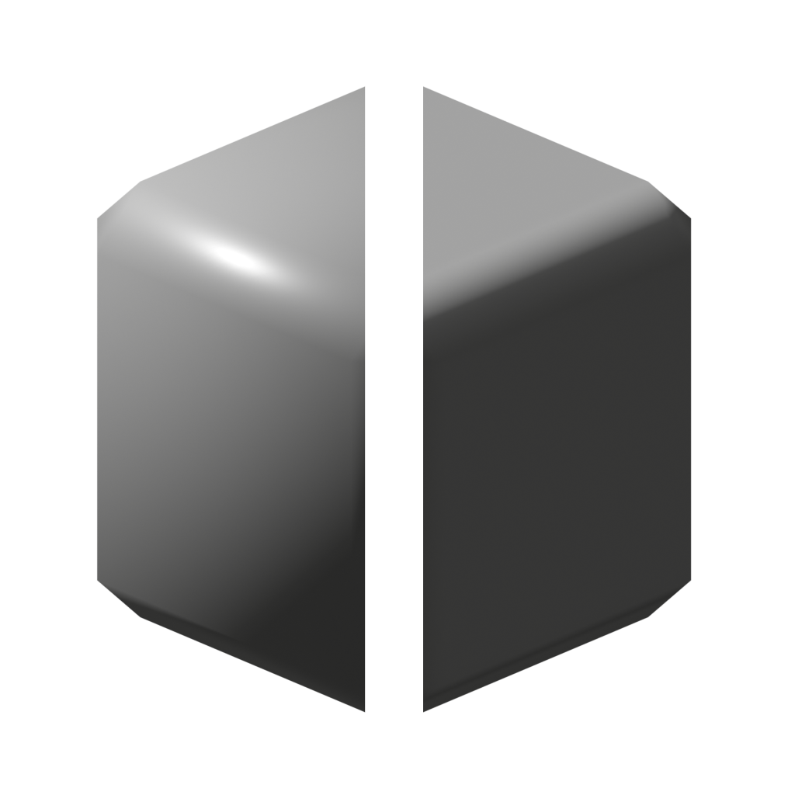
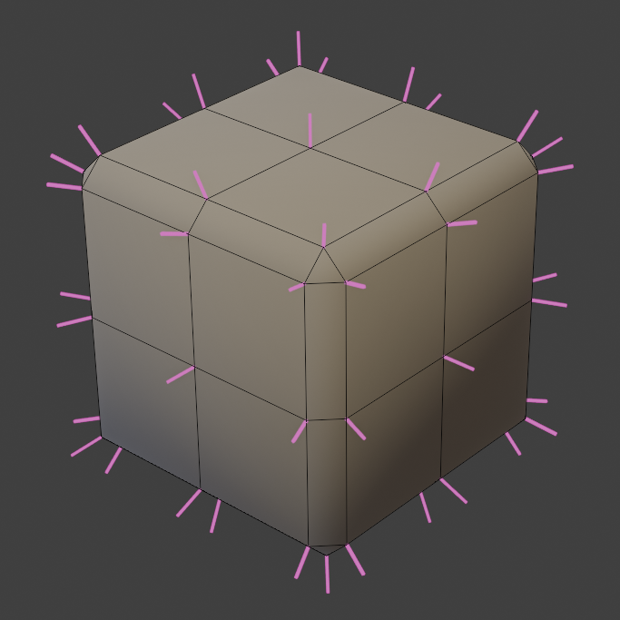
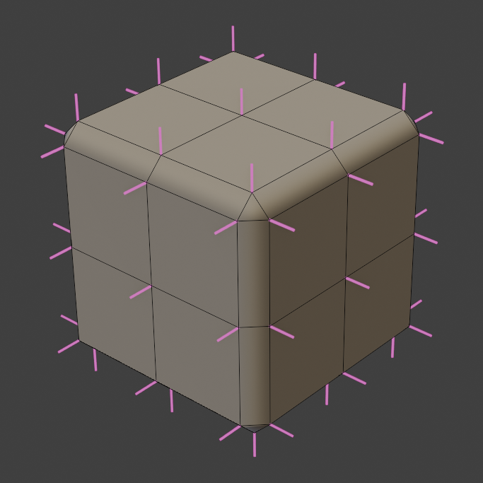

# Face Weighted Normals

{width=128}

Calculate face weighted normals for a mesh. This is similar to Blender's built-in [Weighted Normals Modifier](https://docs.blender.org/manual/en/latest/modeling/modifiers/normals/weighted_normal.html) but with some differences:

- Selection Panel lets you limit weighted normals to a specific part of your mesh.
- Options are designed to be more intuitive.

!!! warning ""Corner Angle" weighting is not yet implemented"
    This can create some odd shading on certain topology and is planned for a future update.

-   
Un-weighted normals

-   
Weighted normals

## Options

- **Normal Domain.** Whether normals are stored on points (smooth) or face corners (allows sharp edges).
- **Weight.** Derive normal weights from:
    - **Face Area.** Faces with larger area have more influence over normals.
    - **Face Strength.** Use the "Face Strength" attribute. [Official Documentation](https://docs.blender.org/manual/en/latest/modeling/meshes/editing/mesh/normals.html#set-face-strength)
    - **Attribute.** Define an attribute to use for normal weighting.
- **Keep Sharp.** Keep sharp edges on face corners.

### Area Weights
Have more control over area-weighted normals.

- **Area Bias.** Bend normals towards faces with larger areas. 1 = Direct weight based on area. Higher values will weight more
aggressively to larger areas.
- **Area Cutoff.** Ignores normals from smaller faces. Cutoff is a percentage of face area compared to the largest connected face.

## Selection

See [Selection](../common_settings.md#selection) options.