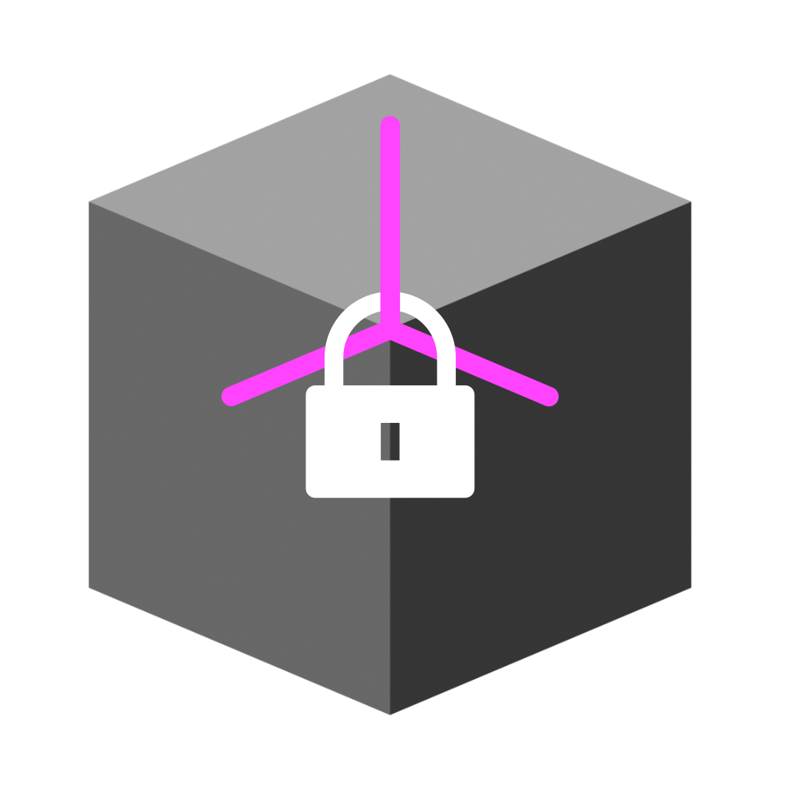

# Lock Normals

{ width=128 }

Creates custom normals for a mesh if none exist. Can also be used to convert between "Free" and "Tangent Space" normals,
see the [Blender Docs](https://docs.blender.org/manual/en/latest/modeling/geometry_nodes/mesh/write/set_mesh_normal.html#properties):

## Options

- **Custom Normal Type:** How to store custom normals:
    - **Free:** Store custom normals as simple vectors in the local space of the mesh. This is efficient and fast to evaluate but does not support deformation.
    - **Tangent Space:** Store normals in a deformation dependent custom transformation space. This method is slower, but can be better when subsequent operations change the mesh without handling normals specifically.

- **Normal Domain:** When ***Custom Normal Type*** is set to ***Free***:
    - **Face Corner.** Store normals on face corners, allows for sharp edges.
    - **Point.** Store normals on points, cannot have sharp edges.