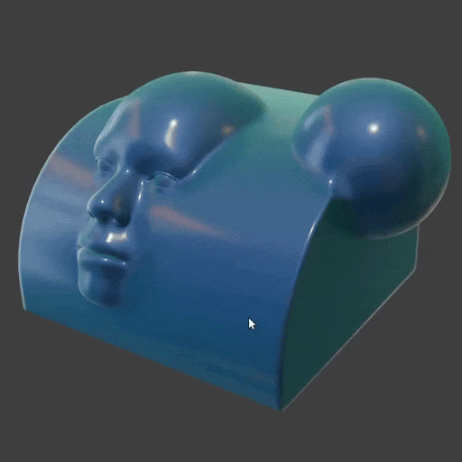
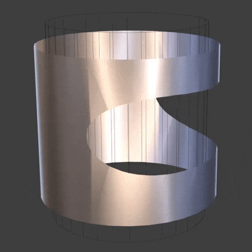
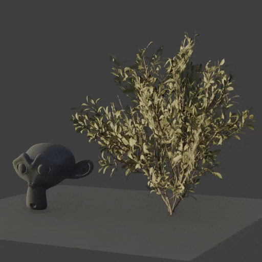
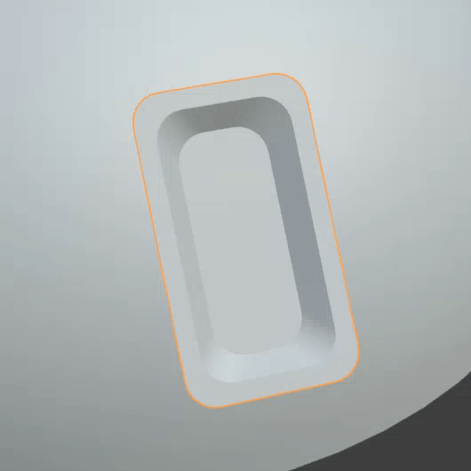

# Normal Transfer

{width=128}

Transfer Normals from other mesh objects. This can be useful in a variety of situations:

-   
Blend between meshes without affecting geometry.

-   
Fix / smooth shading of bad topology. See also [Smooth Normals](./smooth_normals.md) and [Boolean Pro](../mesh_tools/boolean_pro.md)

-   
Create better shading for foliage cards.

- 
Match normals of "floater" decals. See also [Surface Project](../mesh_tools/surface_project.md)

## Examples

Examples can be found in the **Normal Modifiers** scene in the [example file](../examples.md)

## Options

- **Normal Domain.** Whether normals are stored on points (smooth) or face corners (allows sharp edges).

### Transfer Geometry

Choose which meshes to transfer normals from.

- **Object Count.** How many mesh objects to transfer normals from.
- **Objects.** Choose individual mesh objects to transfer normals from.
- **Collection.** Choose a collection containing mesh objects to transfer normals from.

### Transfer

- **Method.** How to sample the normal from target surface:
    - **Closest Surface.** Sample normal at closest target surface.
    - **Project Object Direction.** Raycast-sample target geometry in object space.
    - **Project Island Normal.** Raycast-sample target geometry along the average mesh island normal.
    - **Project Source Normals.** Raycast-sample target geometry along mesh normals of this object.

- **Ray Length (Project Methods).** Maximum length of raycast to target surface.
- **Direction (Project Object Direction Only).** Direction in object space to raycast (default is -Z).

- **Automatic Masking.** Mask falloff for transferring normals, see [Mask Falloff](../common_settings.md#mask-falloff)

### Selection

See [Selection](../common_settings.md#selection) options.