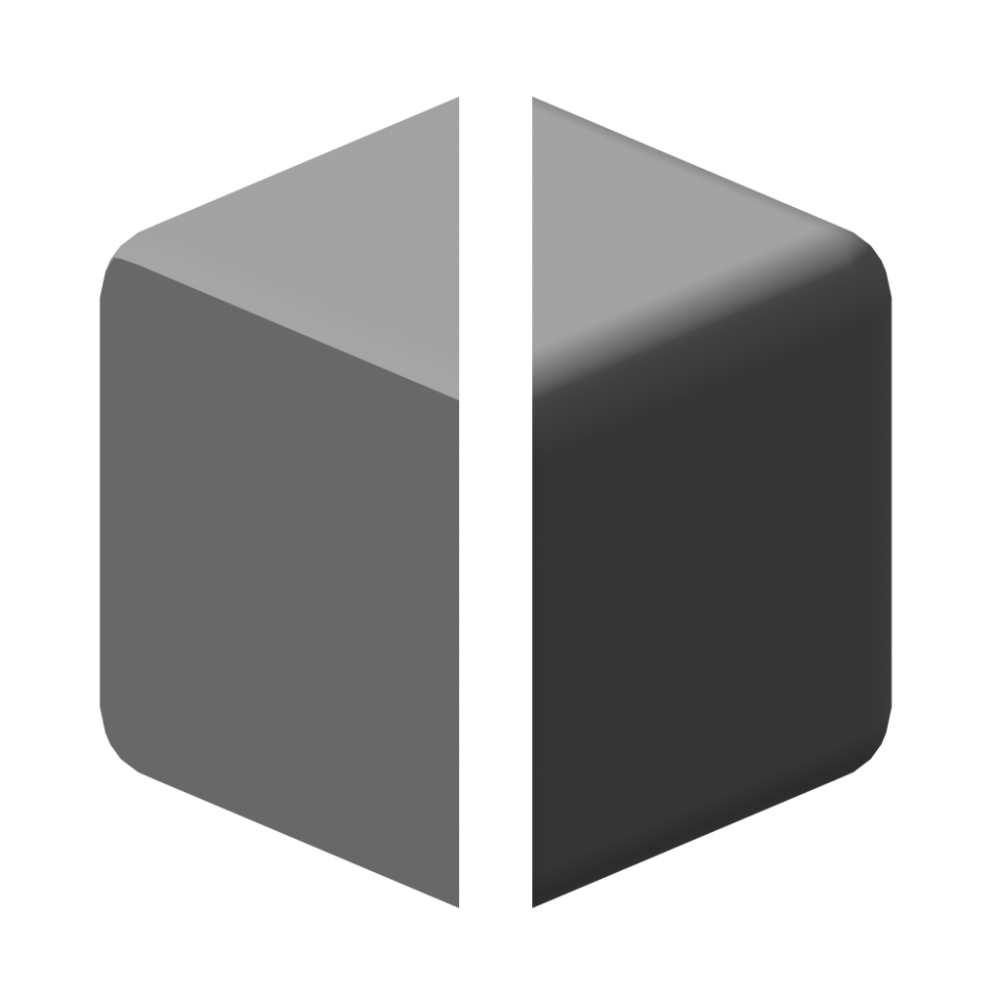
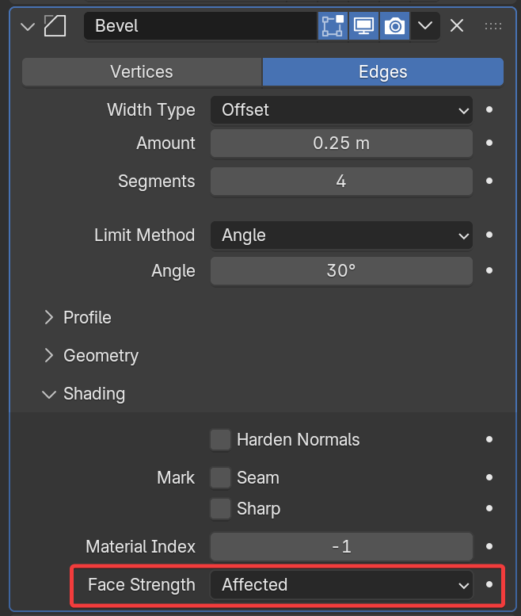

# Repair Bevel Normals

{ width=128 }

Beveling a mesh with custom normals can lead to unexpected behavior. This tool identifies bevels and replicates Blender's "Harden Normals" functionality found on the bevel modifier.

-   
    Bevel with custom normals
-   
    Repaired Normals

## Requirements

- Mesh object with beveled faces you wish to fix
- (Recommended) Set **Face Strength** to "Affected" or "All" on the bevel modifier  

    { width=250 }

## Options

### Bevel Detection

How to detect bevelled faces.

- **Face Strength.** Recommended option. Requires setting face strength on bevel modifier to "Affected" or "All"
    - **Sharp Bevel Edge.** Apply sharp edges to bevel's outer edges.
    - **Sharp Bevel Corners.** Apply sharp edges to bevel's corners.

- **Face Area.** Select bevels by their face area.
    - **Max Bevel Area.** Faces with area below this value will be treated as bevels

- **Attribute.** Use an attribute or vertex group to select beveled faces.

### Area Weighting

For weighting normals **inside** the bevel. Available when [Bevel Detection](#bevel-detection) is set to **Face Area** or **Attribute**

- **Area Bias.** Bend normals towards faces with larger areas. 1 = Direct weight based on area. Higher values will weight more aggressively to larger areas.
- **Area Cutoff.** Ignores normals from smaller faces. Cutoff is a percentage of face area compared to the largest connected face

### Selection Panel

See [Selection](../common_settings.md#selection) options