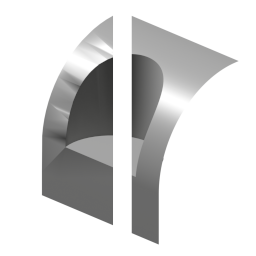

# Repair Boolean Normals

{ width=128}

This tool does its best to fix bad normals on geometry caused by booleans. This is intended for destructively applied booleans, for boolean modifiers please consider using [Boolean Pro](../mesh_tools/boolean_pro.md) as it provides much more accurate and consistent results

## Requirements

1. Mesh object with destructive booleans applied.
2. Mesh is un-triangulated i.e. boolean operations have created ngons.
3. Mesh has sharp edges on boolean seams.

Even if a mesh meets all these requirements it isn't 100% guaranteed to fix all it's normals

## Options

### Error Correct Distance

Welds vertices on the proxy mesh that normals are transferred from.

This can fix normal issues but will also introduce more issues as the value increases. There should be a sweet spot where there aren't any issues

### Selection Panel

See [Selection](asdf.md) page

## How it Works

1. Splitting the mesh on sharp edges, producing a surface for each "normal island"
2. Detecting points on the boundary that don't join to any edges inside the island
3. Re-creating a version of each island without those points
4. Transferring normals per newly created island back up to the unaltered geometry

