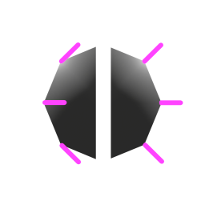
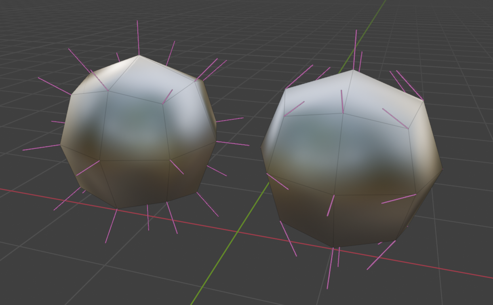
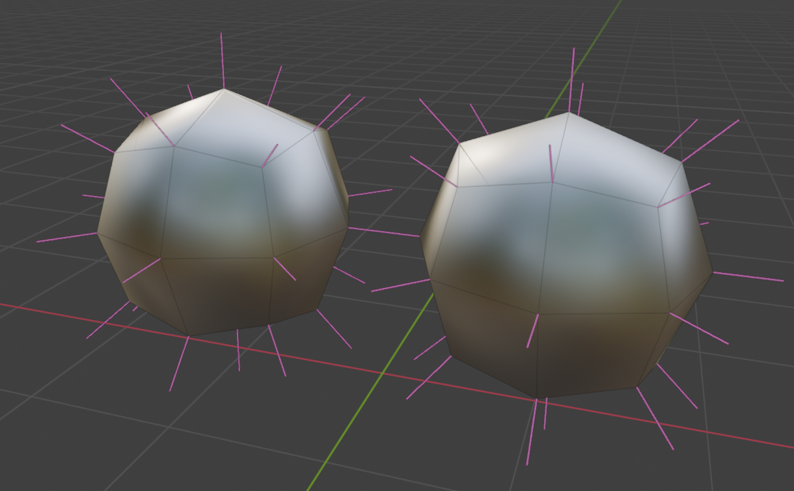

# Repair Mirrored Normals

{width=128}

Mirroring a mesh with custom normals will not mirror the normals. This leads to incorrect normals on the mirrored geometry. 
This modifier can repair these normals by flipping them in the correct direction.

!!! tip "Symmetrize"
    Try the [Symmetrize](../mesh_tools/symmetrize.md) modifier instead for mirroring with custom normals.

- 
Unmirrored Custom Normals
- 
Mirrored Custom Normals

## Options

- **Normal Domain:** Whether normals are stored on points (smooth) or face corners (allows sharp edges)
- **Method:** Choose which faces get mirrored normals:
    - **Detect:** Faces and axes will be determined automatically, this should work in most cases.
    - **[Side of Origin:](#side-of-origin)** Select and mirror normals based on axis and object origin.
    - **[Specify:](#specify)** Specify which faces to flip normals and which axes to flip them on.
- **Mirror Object:** If using a mirror object, specify it here.

### Side of Origin
Flip normals for faces on the "mirrored" side. Use this method when using "Bisect" on a mirror modifier or when original geometry doesn't cross the mirror plane(s).

- **Recalculate Center Normals:** Recalculate Normals for points at the center of specified axes.
- **Mirror Axis:** Which axes to select and mirror normals on.
- **Flip Axis:** Flip the direction of the selection of normals to mirror.

### Specify
Choose which faces have flipped normals and what axis to flip them on. Use when geometry is mirrored across both sides of the mirror plane(s) and "Bisect" is turned off.

- **Mirror Axis:** Which axes to select and mirror normals on.
- **Selection:** See [Selection Options](../common_settings.md#selection)