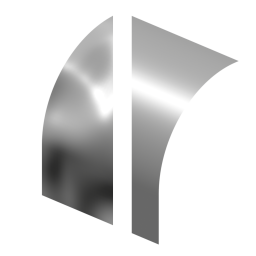
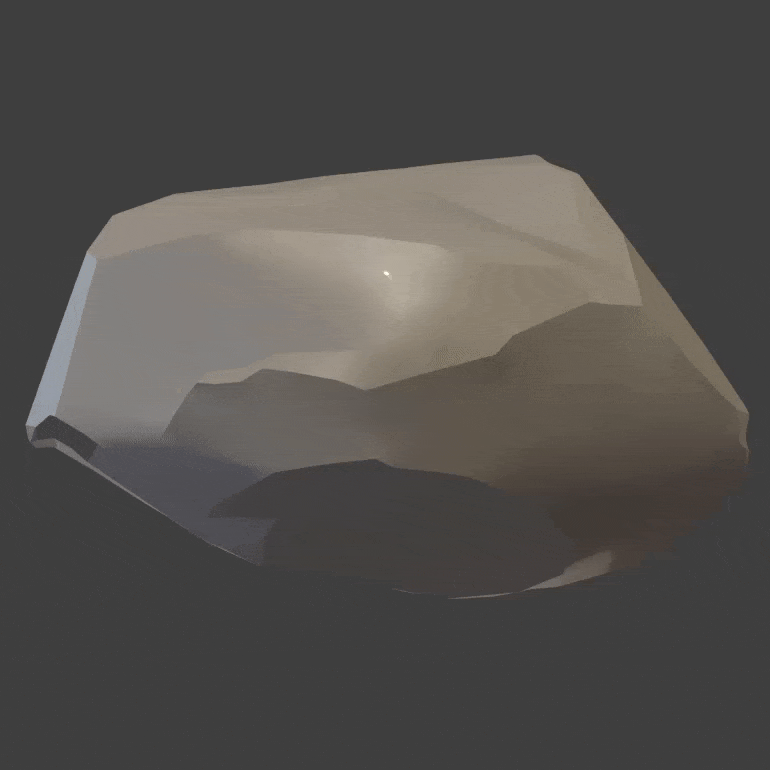
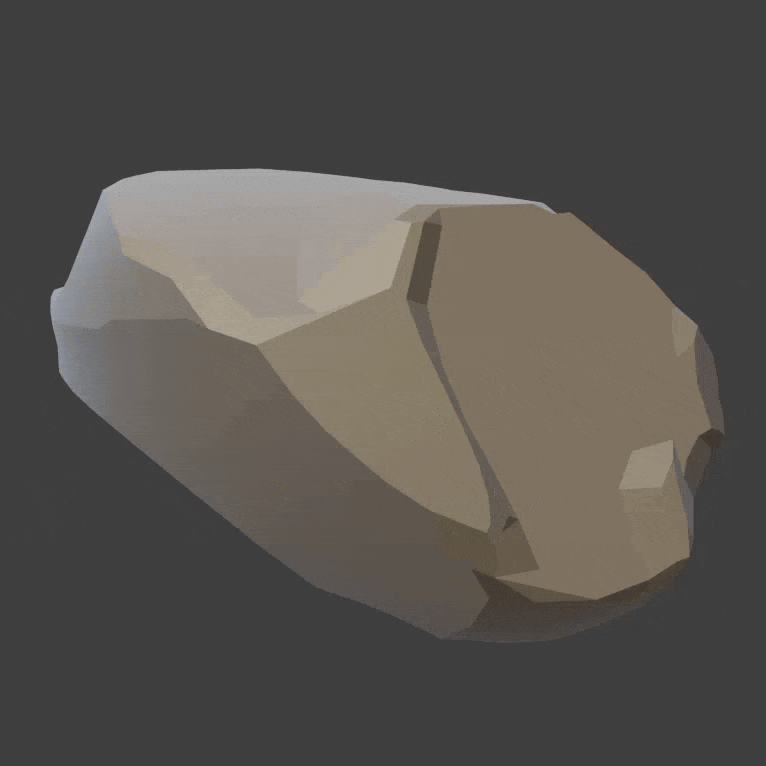

# Smooth Normals

{width=128}

Smooth Normals will smooth mesh normals without smoothing mesh topology. This can be useful in a variety of situations.

- 
    Achieve good shading on difficult topology. (Pinched, uneven or distorted normals).

- 
    Simplify cel shading contours.

- 
    Smooth and/or completely flatten normal islands.

- 
    Mix smoothed point normals for a unique effect (cheap SSS shading).

## Options

- **Normal Domain.** Whether normals are stored on points (smooth) or face corners (allows sharp edges).
- **Keep Sharp.** Keep edges marked as sharp when normals are on face corners.

### Smoothed Proxy Mesh
Generate a smoothed version of the mesh to transfer normals from. The mesh is split on sharp edges before smoothing, you can preview this mesh from the debug panel.

{width=256}

- **Transfer Method.** How to transfer the normals from the smoothed mesh.
    - **Closest Surface.** Transfer normals from the closest point of the smoothed mesh.
    - **Point Index.** Transfer normals by their original point index.
- **Iterations.** How many iterations of smoothing to perform.

### Smooth Normals
Controls methods of directly smoothing mesh normals.

- **Smooth Method.** How to smooth normals:
    - **None.** Don't perform any direct normal smoothing.
    - **Blur Normals.** Fastest Method of smoothing at the cost of being less accurate and not preserving shape as well.
    - **Smooth Normals.** Iterative smooth function of normals. Slower than blur but can produce better results.

- **Smooth/Blur Iterations.** How many iterations of smoothing to apply to normals.
- **Face Weight Influence.** Cheap approximation of face weighted normals, lessens the contribution of smaller faces.

### Flatten Normal Islands
Calculate the average normal direction for entire normal islands (defined by sharp edges).

- **Amount.** How much to blend to the completely flat island normals.

### Mix Point Normals
Mix in smoothed point normals. This can achieve a unique effect, somewhat like sub-surface scattering.

- **Amount.** How much to blend to the smoothed point normals.
- **Blur Iterations.** Perform blur iterations on the point normals.

### Selection
See [Selection](../common_settings.md#selection) options
