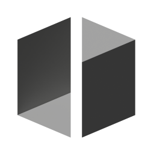

# Auto-Flip Faces

{ width=128 }

Flipped faces on meshes can cause multiple issues. Traditionally you would check for flipped faces by using the the 'Face Orientation' overlay and resolve areas of flipped faces one by one.

This modifier will detect flipped faces and fix them automatically.

-  
Faces Flipped
- 
Faces Un-flipped

## Options

- **Invert.** Change direction of entire mesh from outside to inside
- **Hit Rate.** Tune the detection of flipped faces. Higher values will detect more but increase the risk of false positives.