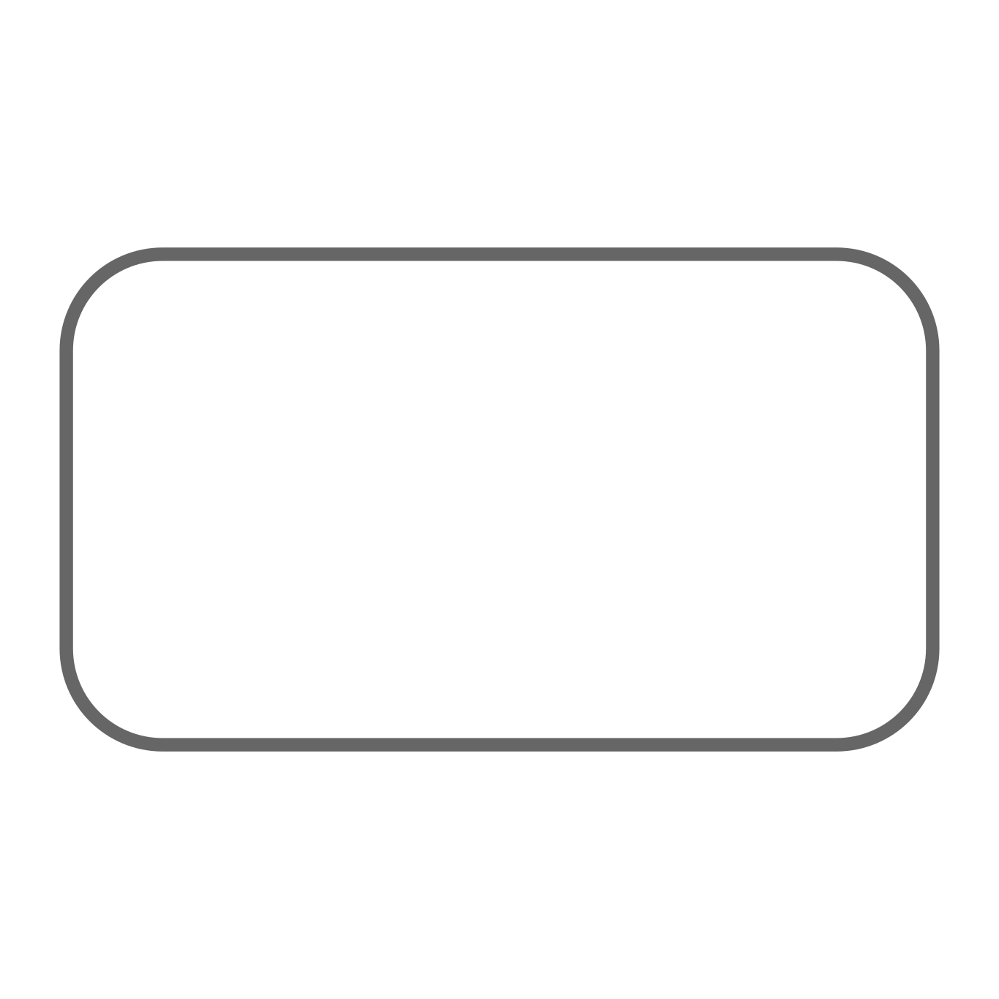
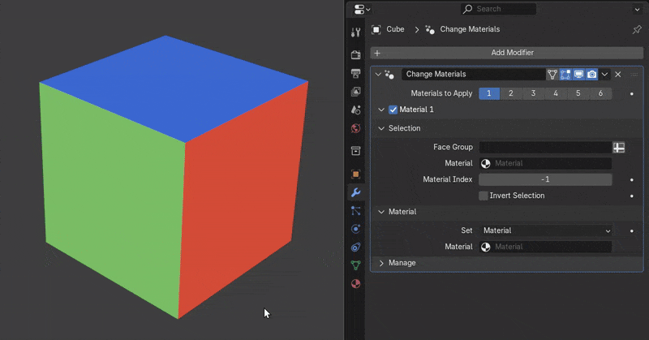

# Change Materials

{ width=128 }

Assign materials or material indices to face selections.

Up to 6 materials can be assigned per modifier. Selections can be driven by existing material/index or arbitrary vertex/face groups.

## Options

- **Materials to Apply:** The number of materials to apply. This will show a panel for each material with a checkbox to enable/disable.

### Material *
Panel for each material assignment, contains two panels: One for selecting faces and one for specifying material/index.

#### Selection

Choose which faces to apply a material to.

- **Face Group:** Specify a vertex/face group to apply materials to.
- **Material:** Select faces by a specific material.
- **Material Index:** Select faces by their material index.
- **Invert:** Invert selection

#### Material

Which material to apply to selected faces.

- **Set:** Whether to set a specific material or material index.
- **Material:** Which specific material to apply.
- **Material Index:** Which material index to apply.

