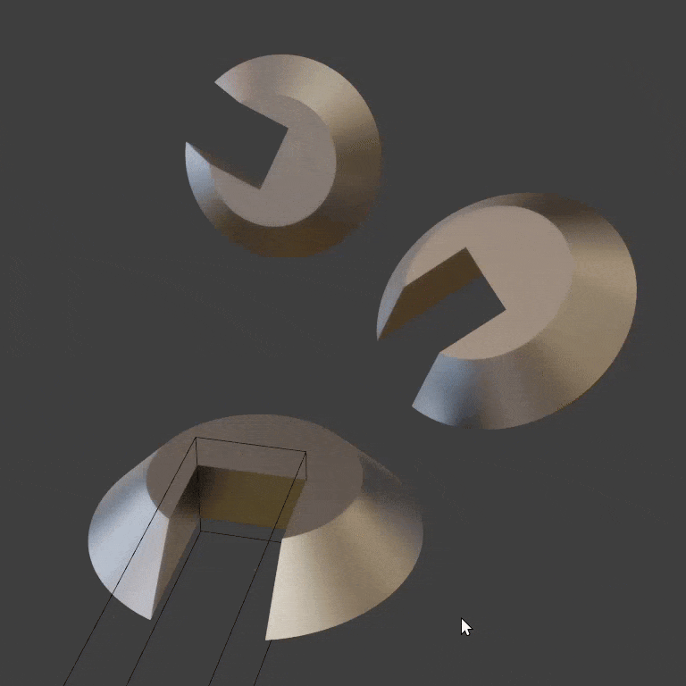
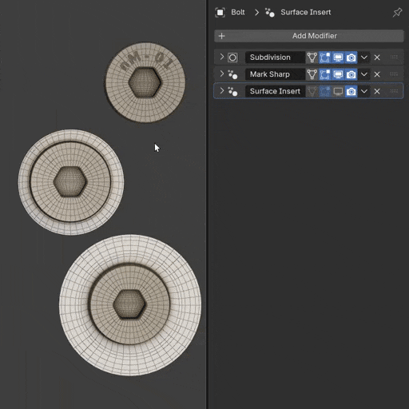
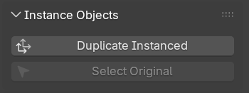

# Instance Object

Instances another object (after modifiers) to replace or append to the current objects geometry. This can be particularly useful when re-using details.

Create duplicates of an object without needing to sync all modifier settings to the duplicates.

Append to and nest modular pieces. Such as these bolt inserts, these can be instanced themselves and used with [Surface Insert](../mesh_tools/surface_insert.md) on larger meshes.

!!! tip "Add-on"
    The normalMagic [Add-on](../add-on/index.md) has instance operators:
    
    

    - Create a linked duplicate of an object(s), replace all modifiers with **Instance Object**
    - Select original object being instanced

## Options

- **Object.** Object to instance
- **As Instance.** When turned off, will copy object's geometry. Turned on will instance the object [Official Documentation](https://docs.blender.org/manual/en/latest/modeling/geometry_nodes/instances.html)
- **Replace / Append.** Replace will replace current objects geometry with that of the instance. Append will keep geometry and append the instanced object with additional transform options.

### Transform Instance
When appending the instance, these settings allow you to transform the instance relative to the objects origin.