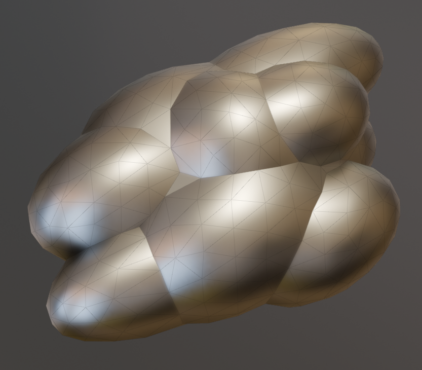

# Mark Sharp

{ width=128 }

Mark Sharp will mark edges as sharp based on edge angle. This is similar to Blender's [Smooth By Angle](https://docs.blender.org/manual/en/latest/modeling/geometry_nodes/normals/smooth_by_angle.html) modifier but with extra options. There is also the option to remove custom normals.

-  
**Smooth By Angle**  
One angle for all edges
- 
**Mark Sharp**  
Separate angles for convex/concave edges

## Options

- **Keep Existing.** Keep edges marked as sharp.
- **Angle Type.** 
    - **Absolute Angle.** Use a single angle regardless off convexity. This behaves like "Smooth By Angle".
    - **Convex / Concave.** Specify different angles depending whether edges are convex or concave.
- **Remove Custom Normals.** Will remove any custom normals from geometry and use default normal calculation from sharp edges.