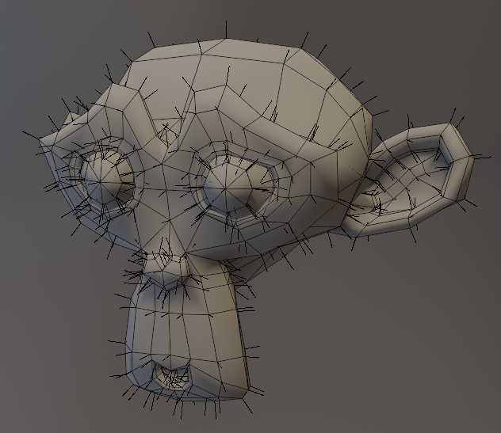
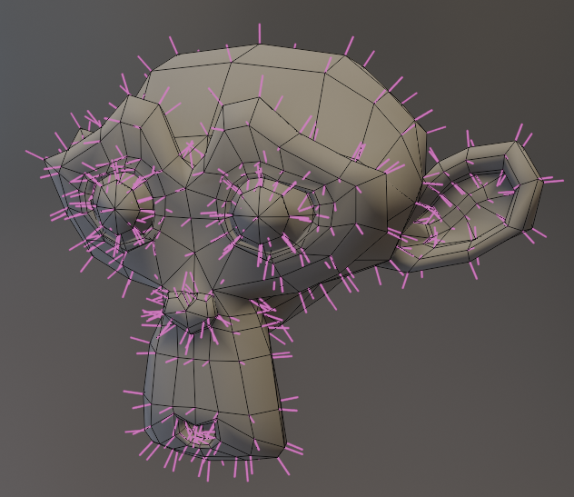

# View Normals

{width=128}

View Normals creates geometry to visualize mesh normals on objects.

- Normals will show up in object mode
- Normal Colors are currently only available in [Material Preview](https://docs.blender.org/manual/en/latest/editors/3dview/display/shading.html#material-preview) and [Rendered](https://docs.blender.org/manual/en/latest/editors/3dview/display/shading.html#rendered) viewport shading.

## Options

- **Length.** The object-space length of displayed normals
- **Normal Domain.** Display normals on:
    - **Points.** One line will be generated per point.
    - **Face Corners.** One line will be generated per face corner.
    - **Faces.** One line will be generated per face.
- **View.** Specify which normal to visualize:
    - **Normal.** Display the normal stored on the geometry, custom normals will be included here.
    - **True Normal.** Display the normal defined by topology, custom normals will be ignored.
    - **Attribute.** Specify an arbitrary attribute to use.

### Style
This section defines how the normal line mesh is generated:

Line
    {width=512}
    Display normals as a single line. This is the most efficient but can't be colored.

Cylinder / Tapered Cylinder
    {width=512}
    Display Normals as mesh cylinders with a width and color that will show up in [Material Preview](https://docs.blender.org/manual/en/latest/editors/3dview/display/shading.html#material-preview) and [Rendered](https://docs.blender.org/manual/en/latest/editors/3dview/display/shading.html#rendered) viewport shading

#### Colors

(When in Cylinder / Tapered Cylinder mode)

- **Color.** Color to display normals.
- **Show Default.** Colors normals differently if they match default "Smooth Shading" normals:

    