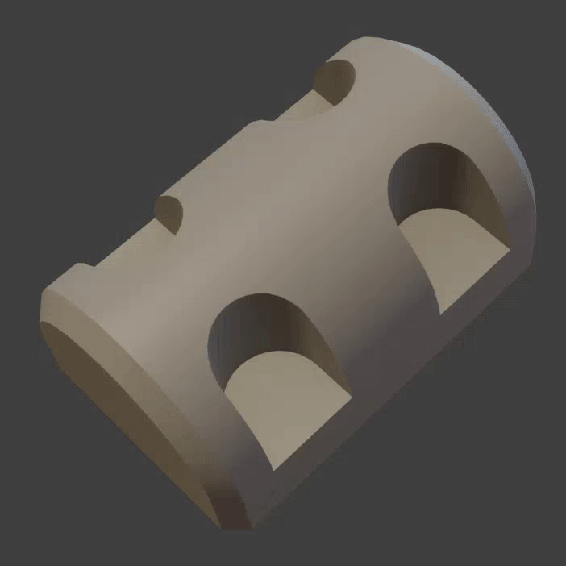

# View Sharp

{width=128}

View sharp generates geometry to visualize sharp edges on a mesh. Similar to [View Normals](./view_normals.md) colors are currently only available in [Material Preview](https://docs.blender.org/manual/en/latest/editors/3dview/display/shading.html#material-preview) and [Rendered](https://docs.blender.org/manual/en/latest/editors/3dview/display/shading.html#rendered) viewport shading.

{width=512}

## Options

- **Detect Sharp.** How to detect sharp edges:
    - **From Markup.** Use smooth shading attributes to define sharp edges. This might miss sharp edges defined by custom normals.
    - **From Normals.** Detect sharp edges from normals. This will detect sharp edges created from custom normals but can have a small amount of error.
    - **Both.** Combine both methods above to detect sharp edges.

- **Tolerance (When "From Normals" is used).** Change the normal angle difference at which edges will be marked as sharp.
- **Width.** Width of pipe geometry created in object-space.
- **Color.** Color to apply to sharp edge visualization. 